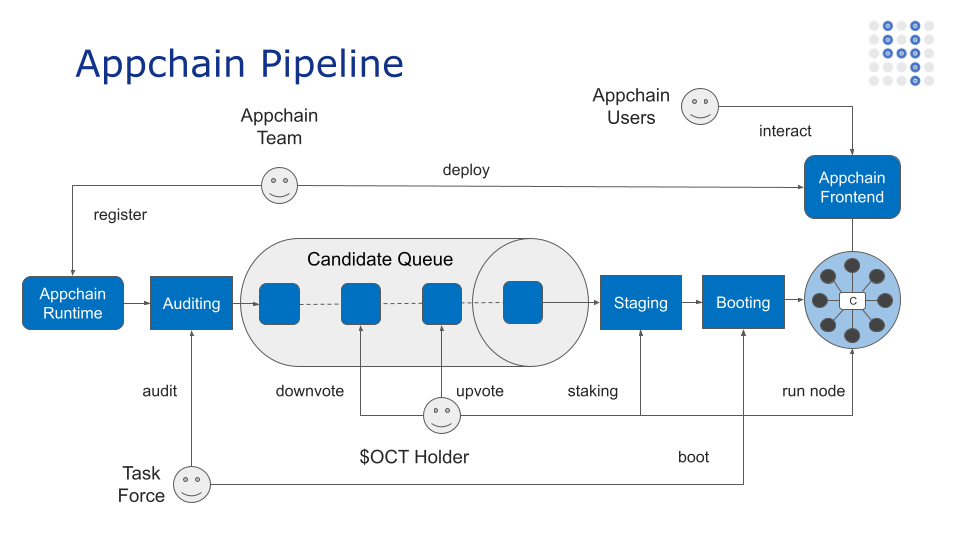

## 应用链指南

在本指南中，我们将学习和实践如何将应用链接入章鱼网络。

**需要做什么**

在开始之前，让我们列出应用链团队在本教程中将要做的事情。

1. [应用链开发](./develop.md)
2. [应用链集成](./integrate.md)
3. [应用链发布](./release.md)
4. [应用链注册](./register.md)

应用链网络启动流程如下图所示：

* 在完成[应用链注册](./register.md)后，流程进入**Auditing**审计阶段，应用链团队可使用注册时的邮箱发邮件通知章鱼团队（appchain@oct.network）进行审计。
* 应用链的代码及其版本发布中的 ChainSpec 文件通过审查后，流程进入**InQueue**排队阶段，OCT 持有者将投票决定该应用链是否进入下个阶段。
* 如果应用链获得赞成，则流程进入**Staging**阶段。一次只会有一个应用链，这时想要成为该应用链[验证节点](../validator/guide.md) 的 OCT 持有者可以为其质押他们的 OCTs。
* 当有足够的验证节点和质押的 OCTs 时，章鱼团队会运行几个验证节点作为启动节点，并启动应用链网络，这时流程进入 **Booting** 阶段，应用链会出区，并欢迎新的验证节点加入。

🎉🎉🎉恭喜！我们很高兴看到应用链团队可以使用这项令人兴奋的技术共同构建 Web3.0！如果还有其它疑问，请随时在 Discord 上与我们聊天！我们将回复您的所有信息🤟