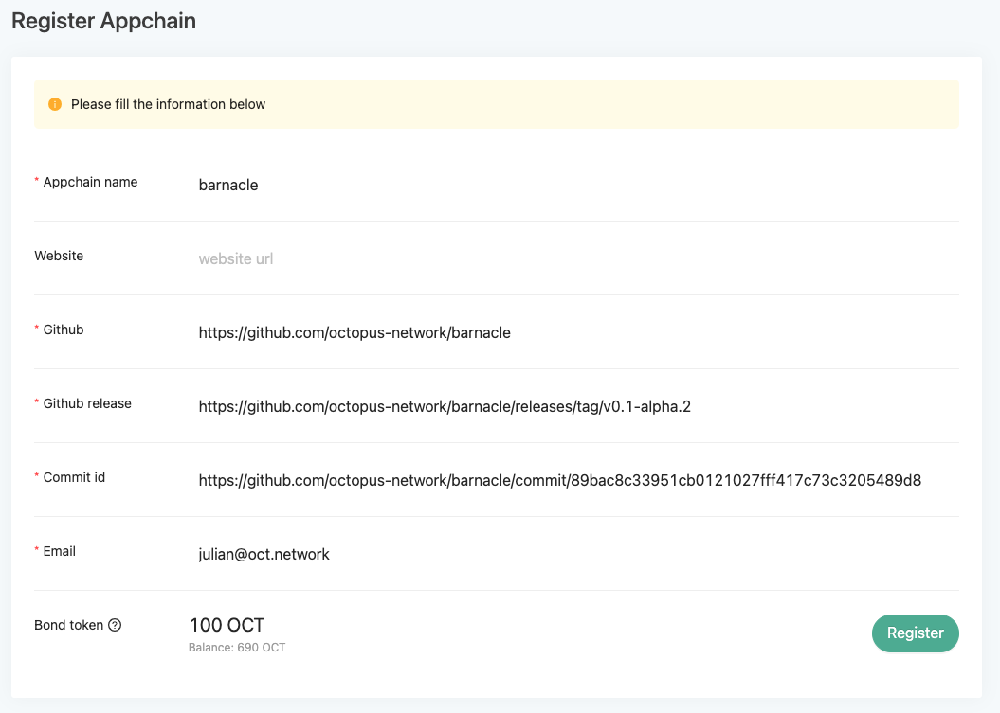

## 应用链注册

### 先决条件

* NEAR 帐户
* OCT：应用链团队需要支付 1k OCT 作为**审计费**。测试网中，应用链团队可以从 Discord 请求测试网 OCT。

### 应用链注册的操作步骤

1. 用 NEAR 帐户登录到章鱼网络[主网](https://mainnet.oct.network) 或 [测试网](https://testnet.oct.network)。
2. 导航到 **Appchains** 页面，点击 **+ Appchain** 按钮，填写以下内容：
    * **Appchain ID**: 3-20个字符，由小写字母、数字和连字符`-`组成，不能以数字开头，开头和结尾不能使用连字符`-`，也就是要符合正则表达式 `[a-z]([-a-z0-9]*[a-z0-9])?`
    * **Token Info**
        - **Token Name**: 应用链原生通证的名称
        - **Token Symbol**: 应用链原生通证的符号
        - **Icon**: 应用链原生通证的图标链接
        - **Decimals**: 应用链原生通证的精度
    * **Website**: 应用链官网
    * **Function Spec**: 应用链功能规范文件的链接
    * **Github**: 应用链的 Github 仓库
    * **Github Release**: 应用链上线章鱼网络，发布版本的Github URL
    * **Initial Supply**: 应用链初始发行的原生通证数量
    * **Premined**: 初始发行总量中 Premined 到 NEAR 网络的 wrapped 通证数量
    * **Beneficiary**: 应用链团队接收 wrapped 通证的 NEAR 钱包账户
    * **IDO Amount**: 在主网上线前，应用链团队使用 Skyward 进行 IDO 的通证数量
    * **Era Reward**: 应用链每天区块奖励的通证数量（1 era = 1天）
    * **Email**: 应用链联系人邮箱

   

3. 点击 *Submit* 发送注册交易。