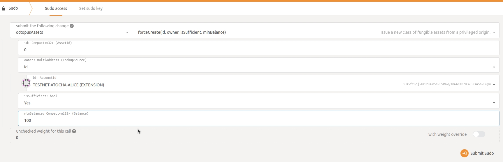
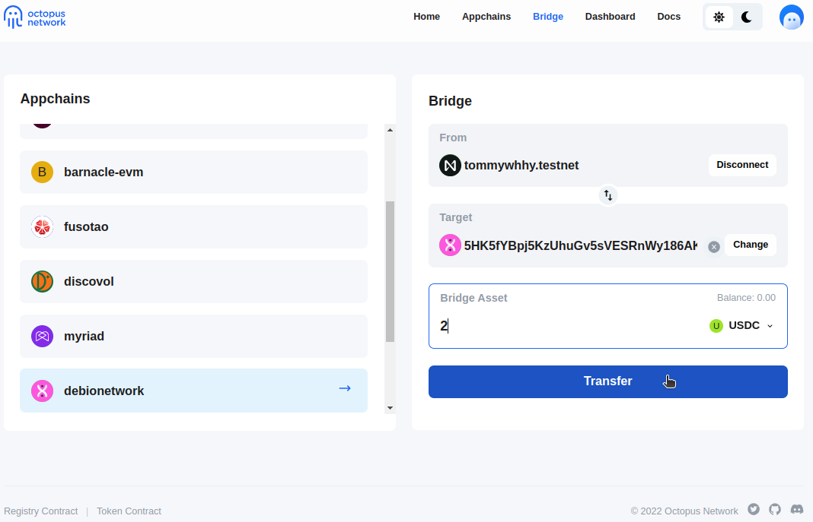
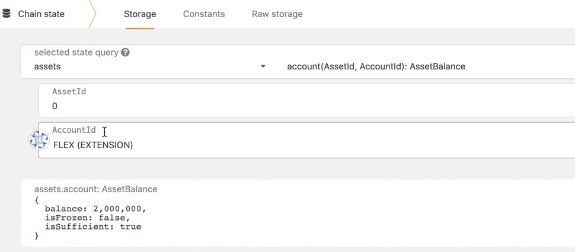
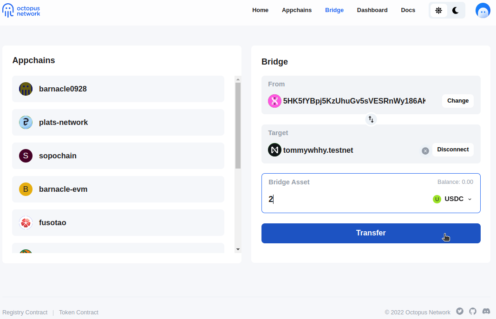

## 转移主链稳定币

章鱼网络为应用链提供了开箱即用的跨链功能，包括主链（NEAR）稳定币转移和应用链原生资产转移。

该指南描述如何通过章鱼内置的跨链功能，在主链和应用链之间完成主链稳定币的跨链转移。以章鱼测试网稳定币USDC为例，具体步骤包括：

* 应用链上创建映射资产
* 主链资产转入应用链
* 应用链转回主链资产


### 创建映射资产

在应用链上线后，如果要使用主链上的稳定币，比如USDC，我们需要先在应用链上创建相对应的映射资产。通常，这一步通过应用链的治理来完成。但是，我们在本指南中使用`sudo`来执行此操作。

我们使用 Polkadot JS 连接应用链。首先设置自定义类型，选择 Settings -> Developer，添加以下 JSON 内容并保存。如下图所示：

```json
{
  "Validator": {
    "id": "AccountId",
    "weight": "u128"
  },
  "ValidatorSet": {
    "sequence_number": "u32",
    "set_id": "u32",
    "validators": "Vec<Validator>"
  },
  "LockEvent": {
    "sequence_number": "u32",
    "token_id": "Vec<u8>",
    "sender_id": "Vec<u8>",
    "receiver": "AccountId",
    "amount": "u128"
  },
  "AssetIdOf": "u32",
  "AssetBalanceOf": "u128",
  "TAssetBalance": "u128",
  "Observation": {
    "_enum": {
      "UpdateValidatorSet": "(ValidatorSet)",
      "LockToken": "(LockEvent)"
    }
  }
}
```


然后，选择 Develper -> Sudo -> assets -> forceCreate，发行一个资产 ID 为 0 的资产。如下图所示：



最后，我们可以检查链状态以查看资产是否正确发行。其中 Asset 0 对应主链上的稳定币USDC（我们在ChainSpec中预设了这个映射，usdc.testnet）。


### 主链转入应用链

打开章鱼测试网的[跨链桥](https://bridge.testnet.oct.network/)页面，我们选择应用链`easydeal-demo`，将稳定币USDC从主链转移到该应用链。同时选择账户`oct.testnet`作为发送人，收款人是个应用链账户的 SS58 地址，我们转账 2 USDC。如下图所示：



几分钟后，应用链验证人验证转账交易后，则会为接收方铸造映射资产。我们可以检查链状态以查看资产是否正确转移，选择 Chain State -> Storage -> assets -> account，可以看到余额为2,000,000，注：精度是6。如下图所示：



### 应用链转回主链

和上一步操作类似，我们仅需切换发送方和接收方账户，即可赎回主链USDC，完成稳定币转账。如下图所示：



资产赎回事件由主链的Octopus Relay验证后，资产余额将会更新。

