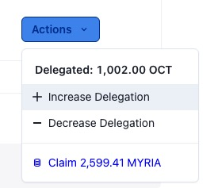

## 委托人操作

委托人委托后，可以通过点击`Action`按钮进行以下操作：

* 增加委托
* 减少委托
* 领取奖励
* 解绑委托（若有未领取的奖励，需先领取奖励）

### 解绑委托并提现质押

您可以停止委托并取回您的质押，有一个延迟退出期，称为解绑期。委托人的解绑期为 28 天，在解绑期结束之前，您将无法转移您的代币，并且在此期间您不会获得任何质押奖励（因为您没有委托给任何验证人）。

解绑期结束后，与验证人相同，您可以通过点击`My Staking`面板中的`Withdraw Stakes`按钮来取回质押。

