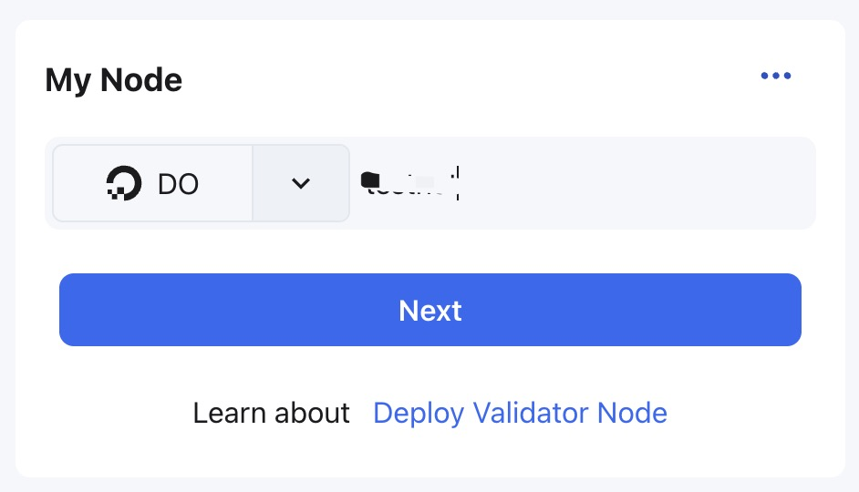
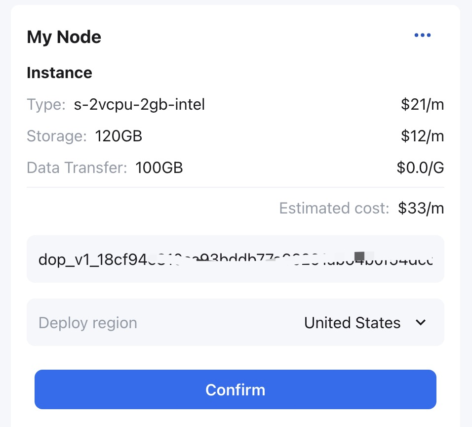
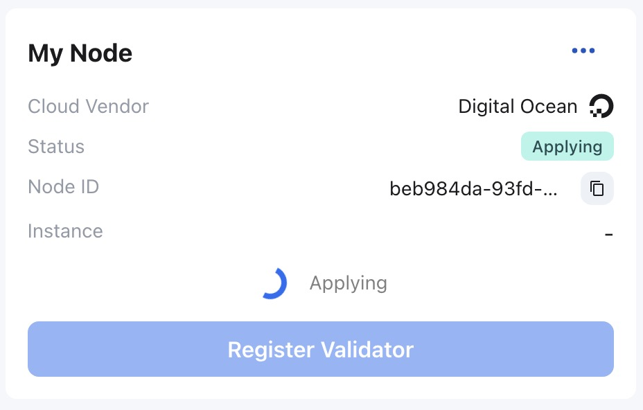
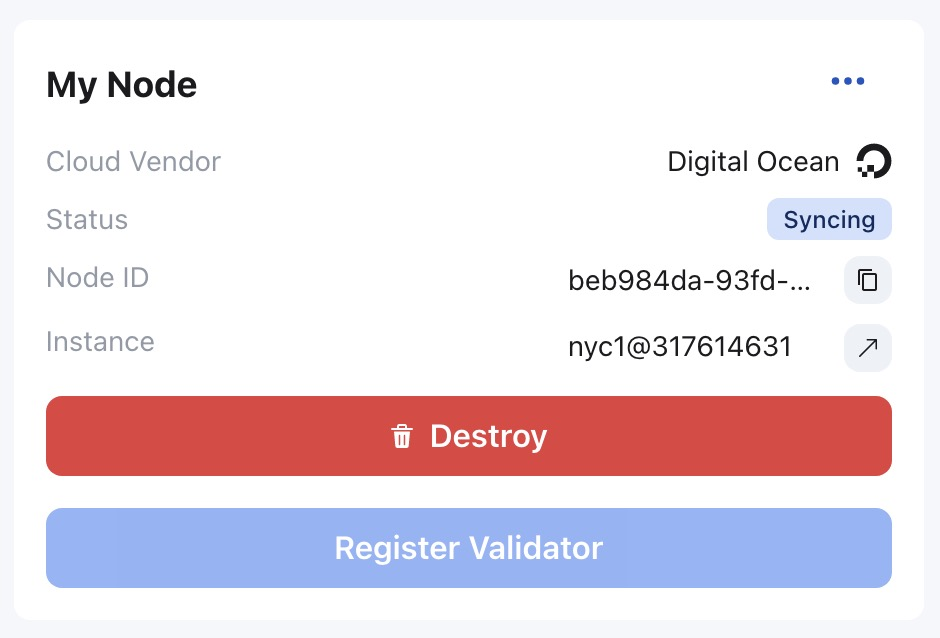
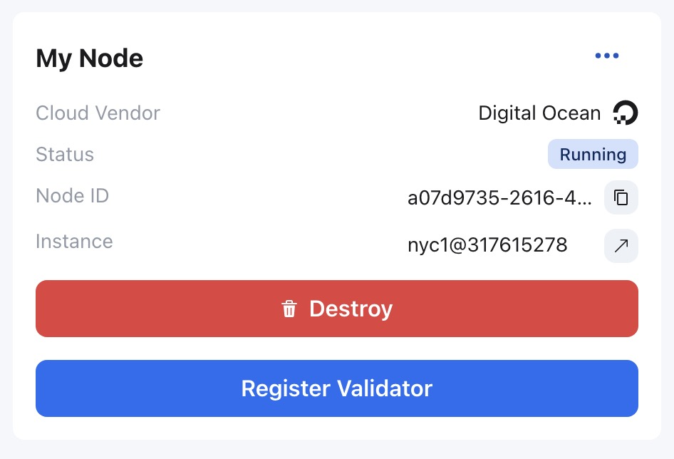

## 使用 Digital Ocean 自动部署验证节点

> 如果没有 Digital Ocean 账户，请先[创建和设置 Digital Ocean 账户](https://docs.digitalocean.com/products/getting-started/)
>
> [创建 Digital Ocean Access Token](https://docs.digitalocean.com/reference/api/create-personal-access-token/)
>
> **注意** 
> 
> 创建完成后，请务必记住 Token Name，并及时地复制保存 Access Token。如果 Access Token 过期失效，请用相同的 Token Name 重新创建。如果更换 Digital Ocean 账户，请使用新的 Token Name 创建 Access Token。

验证人用[生成验证人帐户](./validator-generate-keys.md)中创建的 NEAR 账户访问并登录章鱼网络[主网](https://mainnet.oct.network)。

然后点击`Appchains`选项，在应用链列表中，选择要成为验证人的应用链，点击进入应用链页面，进行以下操作：

1. 在应用链页面 **My Node** 区域，选择 `DO` 并输入`Digital Ocean Token Name`，点击`Deploy`；

2. 在 **My Node** 区域会显示自动部署的 Digital Ocean Droplet 配置信息和大致成本，确认后请输入保存的`Access Token`，并在`Deploy region`下拉框选择部署区域，点击`Confirm`；

**注**：Token 仅会被用于此次部署，并且不会在任何地方被存储。

3. 在 **My Node** 区域节点状态为`Applying`，此时是自动部署服务在部署节点。

请等待大约3~5分钟，节点状态会变为`Syncing`，此时是验证节点在同步应用链的区块数据，越早上线的应用链，节点同步用的时间会越长。请耐心等待。

如需了解节点的同步情况，可参考[监控节点](./monitor-node.md)。

等待节点同步完成后，在 **My Node** 区域节点状态会变为`Running`。

自动部署的验证节点，可以在 **My Node** 区域，点击`···`，选择`Instance Info`可以查看运行验证节点实例的硬件状态信息（比如CPU、硬盘、内存）。

节点状态为`Running`时，可进行下一步操作[注册验证人](./validator-register.md)。