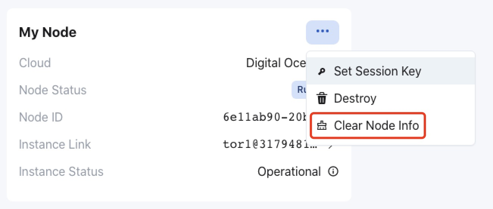

## 部署验证节点

为了简化验证节点部署，章鱼网络提供了自动部署验证节点的服务。目前自动部署支持：

* [AWS](./validator-deploy-aws.md)
* [Digital Ocean](./validator-deploy-do.md)

验证人也可以选择[手动部署验证节点](./validator-deploy-manually.md)。手动部署验证节点，可以参考自动部署使用的硬件配置。

### 硬件配置

自动部署方式启动的各应用链验证节点的配置和大致成本。

**AWS**

| 应用链 | EC2 实例类型  | 存储 | 数据传输 | 每月预估费用 |
|------|------|------|------|------|
| debionetwork | t3.small 2 GB Memory / 2 vCPUs | 120 GB | 100 GB | $45 |
| myriad | t3.small 2 GB Memory / 2 vCPUs | 120 GB | 100 GB | $45 |
| deip | t3.small 2 GB Memory / 2 vCPUs | 120 GB | 100 GB | $45 |
| atocha | t3.small 2 GB Memory / 2 vCPUs | 120 GB | 100 GB | $45 |
| fusotao | c5.large 4 GB Memory / 2 vCPUs | 250 GB | 4500 GB | $509 |
| discovol | t3.small 2 GB Memory / 2 vCPUs | 120 GB | 100 GB | $45 |

**Digital Ocean**

| 应用链 | Droplet  | 存储 | 数据传输 | 每月预估费用 |
|------|------|------|------|------|
| debionetwork | 2 GB Memory / 2 vCPUs | 120 GB | 3 TB | $33 |
| myriad | 2 GB Memory / 2 vCPUs | 120 GB | 3 TB | $33 |
| deip | 2 GB Memory / 2 vCPUs | 120 GB | 3 TB | $33 |
| atocha | 2 GB Memory / 2 vCPUs | 120 GB | 3 TB | $33 |
| fusotao | 8 GB Memory / 4 vCPUs  | 250 GB | 7 TB | $100 |
| discovol | 2 GB Memory / 2 vCPUs | 120 GB | 3 TB | $33 |

### 更换 VPS 服务商

如果已部署节点的验证人要更换 VPS 服务商，请遵循以下步骤：

1. 保持旧的验证节点继续运行；
2. 部署新的验证节点；
自动部署的验证节点，如果需要可以先 `Clear Node Info`。

3. 链数据同步完成后，给新的验证节点[设置 Session Key](./validator-register.md#设置-session-key)；
4. 下一个奖励周期后，[停掉](./validator-register.md#停止验证节点)旧的验证节点。
