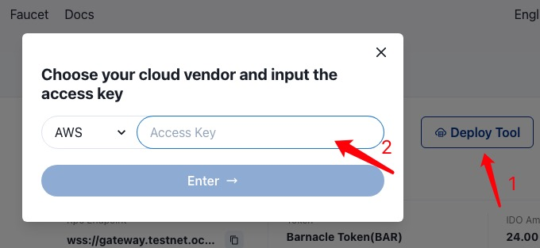
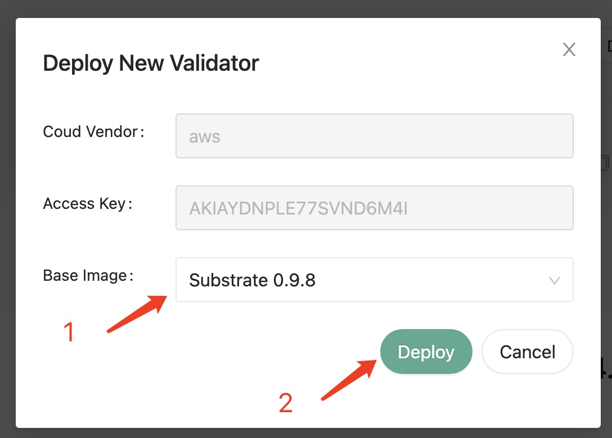
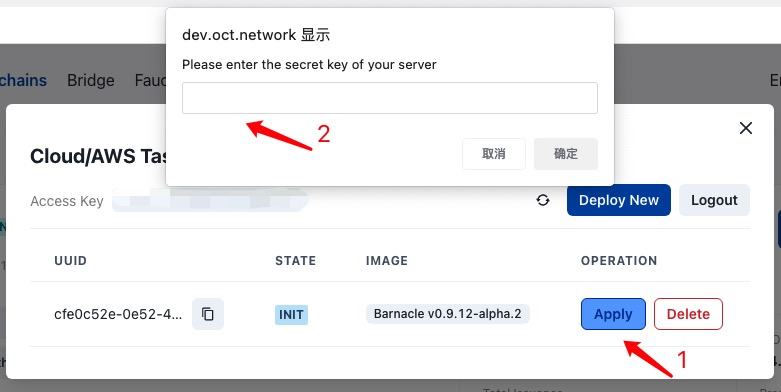
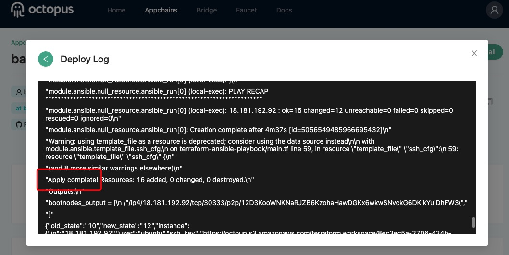
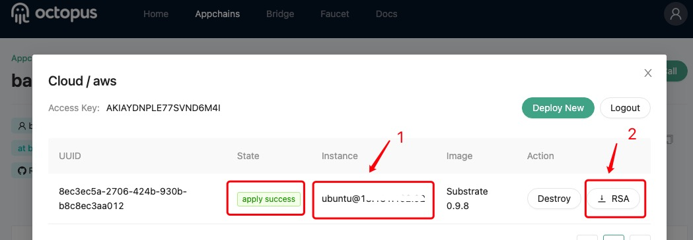

## 搭建验证节点

章鱼网络提供了一键部署验证节点的服务。这是为了简化部署过程，但它不是唯一的方法，验证节点运营商也可以[手动搭建验证节点](./validator-deploy-manually.md)。

**关于验证节点的硬件配置**

> 在测试网络中，我们的一键部署工具使用AWS EC2实例**t3.small**，默认配置为CPU 2核，内存 2G，SSD存储 80G。如果你手动搭建验证节点，可以参考这个配置。
### 自动搭建验证节点

**注**：目前一键部署服务仅支持部署验证节点到 AWS 服务器。

验证人访问章鱼网络[测试网](https://testnet.oct.network/)，在应用链列表中，选择要成为验证人的应用链，点击进入操作页面，进行以下操作：

1. 在操作页面中，点击`Deploy Validator`，在弹出页面中，输入你的`AWS Access Key`，点击`Enter`；

2. 点击`Deploy New`，在弹出页面中，选择`Base Image`，点击`Deploy`；

3. 完成初始化后，点击`Apply`，在弹出的窗口中，输入你的`AWS Access Secret`，点击`Apply`；

**注**：AWS Secret Key 仅会被用于此次部署，并且不会在任何地方被存储，帐户的风险非常低。

4. 部署过程大约持续3-5分钟，点击`Deploy log`获取日志信息；

然后刷新页面查看状态，部署成功如下图所示。

5. 记录 AWS 实例的登录信息，并点击`RSA`下载用于 SSH 登录 AWS 实例的密钥文件。

