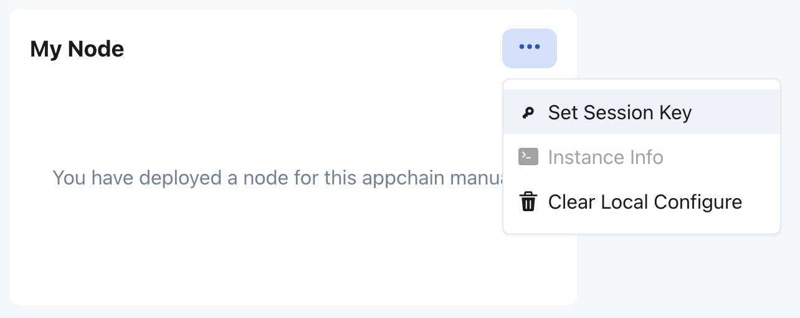
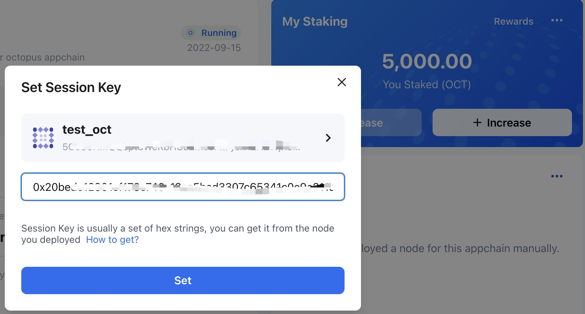

## 注册验证人

注册应用链的验证人，需要完成注册验证人和设置 Session Key 的操作。

### 注册验证人

在应用链页面 **My Node** 区域，点击`Register Validator`。在弹出页面中输入：

* `Appchain Account`，验证人的应用链账号，是在[生成验证人帐户](./validator-generate-keys.md)步骤中生成的地址。
* `Deposit Amount`，验证人质押的 OCT 数量；
* `Email`，验证人的联系邮箱；
* `Twitter ID`，验证人的 Twitter 帐号;
* `Accept delegation`，选择验证人节点是否接受[委托人委托](./delegator-delegate.md)；
    
点击`Register`。

注册成功后，请等待大约1～2分钟，验证人的应用链账户中会收到 1 个应用链的代币，用于进行下一步的操作。

### 设置 Session Key

**注意**，确保验证节点已完成链数据的同步，并且验证人的应用链账户中已收到应用链的代币。

在应用链页面 **My Node** 区域，点击`···`，选择`Set Session Key`，在弹出页面中，选择上一步注册中填写的应用链账户，使用自动部署服务，验证人只需点击`Set`。

手动部署，验证人需要在`Session key`输入框中输入`author_rotateKeys`操作中输出的`result`字段的内容；

设置成功后，并且验证节点正常运行，等待一个奖励周期大约 1 天，它将会进入新一轮的验证人集合中。

#### 检查 Session key

可以通过 PolkadotJS-Apps 检查会话密钥是否设置正确，配置 Apps 的`自定义终端`，应用链的 RPC Endpoit 可以从该应用链在章鱼网络[主网](https://mainnet.oct.network)页面获得。

连接到应用链后导航到`开发者`选项，选择`链状态`，选择`session > nextKeys(AccountId32)`选项，选择验证节点使用的验证人账户，点击`+`。

检查返回值是否和设置的 Session Key 一致。

### 领取质押奖励

在一个奖励周期大约 1 天后，验证人将会获得质押奖励，需要手动领取。在 **My Staking** 区域，点击**Rewards**，在`Validator Reward`列表页面中，点击`Claim`按钮领取奖励。

**警告**：验证人需要及时领取质押奖励，超过 84 天的奖励将无法领取。

### 停止验证

停止验证需要完成解除质押和停止验证节点两步操作。

### 解除质押

在验证人列表中选择验证人，点击`Manage`打开`Validator Profile`页面。

在`Validator Profile`页面中，点击`Unbond Validator`按钮执行解除质押操作。

> **注意**：解除质押操作后，质押的 OCT 有一个解绑期，在解绑期结束之前，无法提现，并且也不会获得任何质押奖励。

### 停止验证节点

对于通过自动部署服务部署的验证节点，验证人可以点击 **My Node** 区域中的 `Destory` 按钮停止验证节点并删除自动部署的实例。

手动部署的验证节点，验证人请记得停掉它。

> **注意**：解除质押后，如果验证人立即停止验证节点，将没有最后一个质押周期的奖励。如果在一个奖励周期后停止它，则仍可以获得奖励。

### 提现质押的 OCT

在应用链的 **My Staking** 区域，点击`···`，选择`Withdraw Stakes`。

解绑期结束后，可以点击`Withdraw`提现质押的 OCT。

