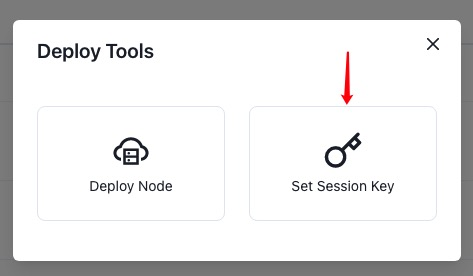

## 设置会话密钥

> **注意**：
>
> * 确保验证节点已完成链数据的同步。

### 生成 Session Keys

您需要通过签名和提交外部信息来告诉链您的会话密钥。有2种方式可以将验证节点与应用链的验证人帐户相关联。

**选项1：CLI**

在部署验证节点的远程服务器（比如：AWS 实例）上运行`author_rotateKeys`命令更容易，若验证节点使用默认的 HTTP RPC 端口配置，命令如下：

```bash
curl -H "Content-Type: application/json" -d '{"id":1, "jsonrpc":"2.0", "method": "author_rotateKeys", "params":[]}' http://localhost:9933
```

输出中有个十六进制编码的“result”字段，保存此字段的值以备后用。

**选项2：PolkadotJS-Apps**

通过 PolkadotJS Apps使用应用链 RPC 生成会话密钥。如果这样做，请确保 PolkadotJS Apps 连接的是验证节点，这可以在设置选项中配置连接验证节点的RPC。

确保已连接到你的验证节点后，设置节点会话密钥的方法是调用`author_rotateKeys`RPC 请求在验证节点的密钥库中创建新密钥。 选择`开发者`选项并选择`RPC Calls`，然后选择`author > rotateKeys()`，记住保存返回的输出，以供后续步骤使用。

### 提交`setKeys`交易

> **注意**：
>
> * Polkadot{.js} 浏览器插件已安装。
> * 验证人的应用链帐户有应用链的原生Token。如果帐户没有余额，可以先通过[Ref Finance](https://app.ref.finance/) 兑换应用链在 NEAR 网络的Token，然后通过[章鱼网络跨链桥](https://mainnet.oct.network/bridge) 转账到在应用链上的验证人帐户。
> * 对于测试网络，通过 Polkadotjs Apps 连接其 RPC，可自行转账获得 Barnacle 应用链的 Token（BAR）。

完成上述准备后，验证人访问章鱼网络([Mainnet](https://mainnet.oct.network) 和 [Testnet](https://testnet.oct.network))，在应用链列表中，选择要成为验证人的应用链，点击进入应用链页面，然后按照步骤设置会话密钥：

1. 在应用链页面，点击`Deploy Tool`，在弹出页面中，选择`Set Session Key`；
2. 在弹出页面中，选择你的应用链账户；
3. 在`Session Key`输入框中输入`author_rotateKeys`操作输出的`result`字段的内容；
4. 点击`Set`。

如下图所示：

