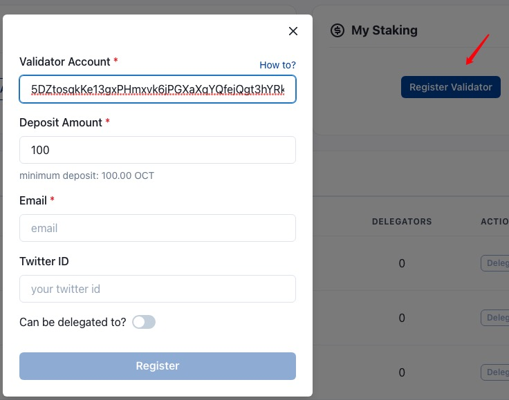
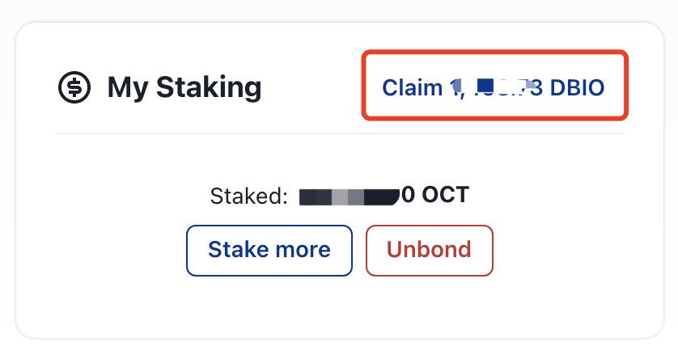
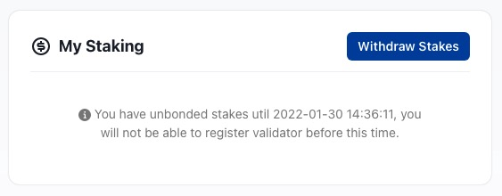

## 质押 OCT

要成为应用链的验证人，需要完成质押 OCT 的操作。

> **注意**
>
> * 验证人的 NEAR 账户应该有一些 NEAR 代币和足够的 OCT 代币用于质押。
> * 对于测试网络，请从[Faucet](https://faucet.testnet.oct.network/)获取 OCT。
> * 如果打算停止验证人，请**务必**先进行`Unbond`操作，并保持节点运行直到下一轮验证人上线。一键部署的验证节点，可以在 **My Node** 区域做`Destory`操作；手动部署的验证节点，则手动停止其验证节点。

验证人访问章鱼网络([Mainnet](https://mainnet.oct.network) 和 [Testnet](https://testnet.oct.network))，选择`Appchains`选项，进入应用链列表页面，并选择想要参与质押的应用链，进行以下操作：

1. 在应用链页面 **My Staking** 区域，点击`Register Validator`；

2. 在弹出页面中，输入：
    * `Validator Account`，验证人的应用链账号，是在[生成验证人帐户](./validator-generate-keys.md)步骤中生成的 SS58 地址。
    * `Staking Amount`，验证人参与质押的 OCT 数量，主网最低为10,000 OCT；
    * `Email`，验证人的联系邮箱；
    * `Twitter ID`，验证人的 Twitter 帐号;
    * 选择是否允许其他 OCT 持有者通过委托将 OCT 委托给验证人节点；
    
点击`Register`。

### 领取奖励

登录章鱼网络[主网](https://mainnet.oct.network)或[测试网](https://testnet.oct.network)，点击 "Appchains"标签，选择参与质押的应用链，然后在 "My Staking" 区域，如果已成为验证人超过 1 个奖励周期，将会看到领取奖励的按钮 "Claim ..." ，点击按钮即可。

**备注**：下图是以 DeBio 应用链为例。

### 停止验证并提现质押

您可以停止做验证人并取回您的质押，有一个延迟退出期，称为解绑期。验证人的解绑期为 28 天，在解绑期结束之前，您将无法转移您的代币，并且在此期间您不会获得任何质押奖励。

解绑期结束后，您可以通过点击`My Staking`面板中的`Withdraw Stakes`按钮来取回质押。

如果您打算停止验证节点，首先您**必须**执行 Unbond 操作并保持验证器节点运行，直到下一轮验证器上线（下一个era结束）。

对于一键部署的节点，您可以在 **My Node** 面板中进行 **Destory** 操作。对于手动部署，您可以手动停止验证器节点。
