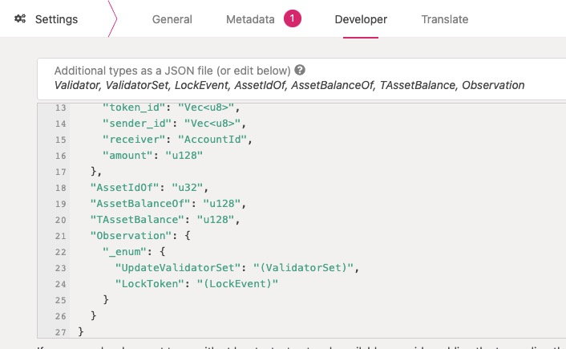
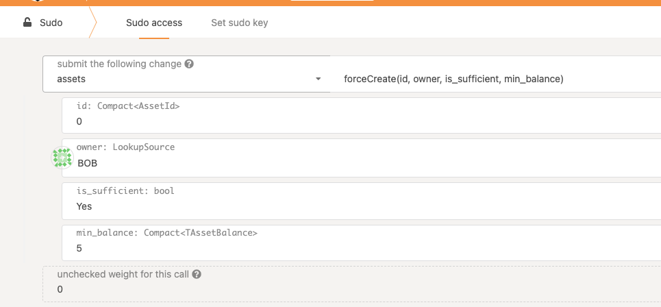
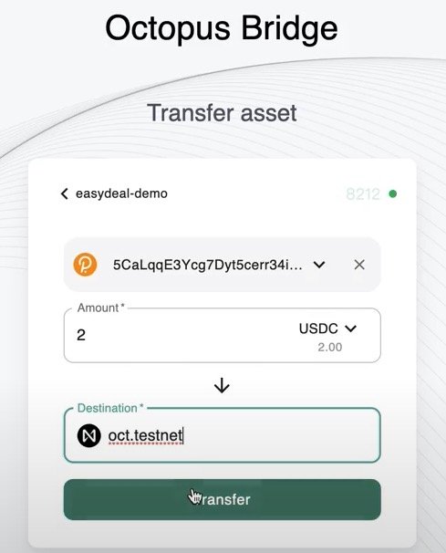

## Mainchain Stablecoin Transfer Guide

Octopus Network provides out-of-the-box cross-chain functions for Appchains, including mainchain (NEAR) stablecoin transfer and Appchain native asset transfer.

This guide takes the stablecoin USDC in the Octopus Test Network as an example to describe how to complete the transfer of mainchain stablecoin between the mainchain and Appchain through Octopus' built-in cross-chain function. The specific steps include.

* Create mapped assets on Appchain
* Transfer mainchain assets to Appchain
* Transfer back to mainchain from Appchain


### Create mapped assets

After the Appchain goes live, if we want to use a stable coin on the mainchain, such as USDC, we need to create the corresponding mapped asset on the Appchain first. Usually, this step is done through the governance of the Appchain. However, we use `sudo` to perform this operation in this guide.

We use Polkadot JS to connect to the Appchain. First set the custom type, select `Settings -> Developer`, add the following JSON content and save it. As shown in the following image.

```json
{
  "Validator": {
    "id": "AccountId",
    "weight": "u128"
  },
  "ValidatorSet": {
    "sequence_number": "u32",
    "set_id": "u32",
    "validators": "Vec<Validator>"
  },
  "LockEvent": {
    "sequence_number": "u32",
    "token_id": "Vec<u8>",
    "sender_id": "Vec<u8>",
    "receiver": "AccountId",
    "amount": "u128"
  },
  "AssetIdOf": "u32",
  "AssetBalanceOf": "u128",
  "TAssetBalance": "u128",
  "Observation": {
    "_enum": {
      "UpdateValidatorSet": "(ValidatorSet)",
      "LockToken": "(LockEvent)"
    }
  }
}
```



Then, select `Develper -> Sudo -> asserts -> forceCreate` to issue an asset with an asset ID of 0. As shown in the following image.



Finally, we can check the chain status to see if the asset was issued correctly. Where Asset 0 corresponds to the stable coin USDC on the mainchain (we have this mapping preset in ChainSpec, `usdc.testnet`).


### Transfer mainchain to Appchain

Open the [cross-chain bridge](https://bridge.testnet.oct.network/) page of Octopus Test Network, we select the Appchain `easydeal-demo` and transfer the stablecoin USDC from the mainchain to that Appchain. At the same time, we select the account `oct.testnet` as the sender, and the payee is the SS58 address of an Appchain account, and we transfer 2 USDC. As shown in the figure below.


After a few minutes, the transfer transaction is verified by the Appchain validators, then the mapped assets are minted for the recipient. We can check the chain state to see if the assets were transferred correctly by selecting `Chain State -> Storage -> asserts -> account` and we can see that the balance is 2,000,000, note: the precision is 6. The following image shows.


### Transfer back to the mainchain from Appchain

Similar to the previous operation, we only need to switch the sender and receiver accounts to redeem the mainchain USDC and complete the stablecoin transfer. As shown in the figure below.



The asset balance will change after the transfer back event is proven by the mainchain verification event.