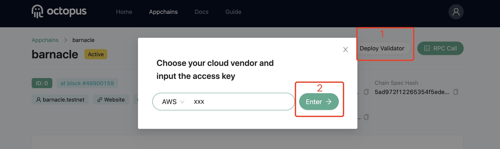

## Deploy validator node

Octopus Network provides a one-click service to deploy validator node. **Note**: Currently only supports deploying validator node to AWS server.

Go to the Octopus network, [testnet](https://testnet.oct.network/), select Appchain Tab page, click Appchain to enter the operation page and complete the following 2 steps:

1. In the operation page, click `Deploy Validator`;
2. In the pop-up page, enter your `AWS Access Key` and click `Enter`; **Note**: Only used for this deployment.

As shown below:

