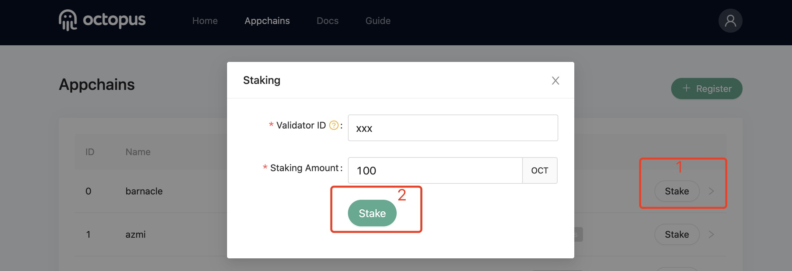

## Stake OCT

To become a validator of Appchain, you need to stake OCT.

Go to the Octopus network, [testnet](https://testnet.oct.network/), click the `Appchains` Tab page, perform the following 2 steps:

1. Select Appchain, and click `Stake`;
2. In the pop-up page, enter your `Validator ID` and `Staking Amount`, and click `Stake`.

As shown below:

