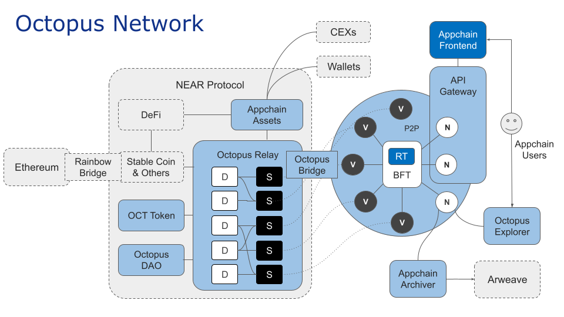

## 章鱼网络概述

章鱼网络服务于 Web3.0 应用的区块链，也称为应用链。章鱼网络为应用链提供灵活且负担得起的租用安全，跨链互操作，基础设施和社区建设指导。

章鱼网络体系结构如下图所示

架构图中缩写的全称如下表。

| 缩写 | 全称  |
|------|------|
| D | Delegator |
| S | Staking |
| V | Validator |
| RT | Runtime |
| N | Node, 不参与质押的节点 | 
| CEXs | 中心化交易所 | 
### 章鱼中继

章鱼中继是运行在 NEAR 区块链网络上的一组智能合约。

### 应用链

应用链是指基于 Substrate 为特定 Web3.0 应用开发的区块链。基于 Substrate 的区块链可以通过集成 [pallet-octopus-appchain](https://github.com/octopus-network/pallet-octopus-appchain)，成为章鱼网络中的应用链加入章鱼网络。

### 验证人

在章鱼网络中，OCT 持有者可以质押 OCT 成为验证人或提名人。验证人通过质押 OCT 和[运行应用链的验证节点](../maintain/validator-guide.md) 来为应用链提供安全。提名人则是通过选择诚实的验证人来保障应用链的安全，其质押 OCT是将被委托给选定的验证人。

验证人将会获得区块奖励，包括交易手续费。验证人将收到应用链原生代币作为验证奖励。如果验证人在网络中行为不端（例如离线、攻击网络或运行修改过的软件）会受到惩罚，他们和其提名人抵押的 OCT 都将因此失去一定比例的罚没。
