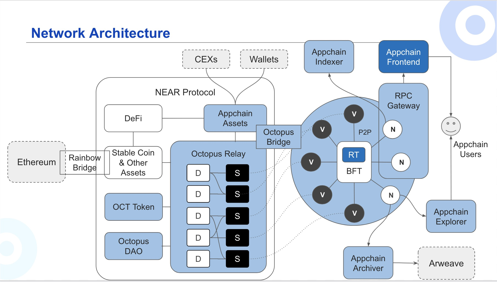

## Octopus Network Overview

Octopus Network is a brand new multichain network born to serve application-specific blockchains, aka Appchain. Octopus Network provides flexible and affordable leased security, out-of-box cross-chain interoperability, one-stop infrastructure, and a ready-to-be-engaged community for the appchains.

The full name of abbreviations in the architecture diagram:

| Abbreviations | Full Name  |
|------|------|
| D | Delegator |
| S | Staking |
| V | Validator, a node involved in staking |
| RT | Runtime |
| N | Node | 

### Octopus Relay

Octopus Relay is the core of the Octopus Network — a set of  [smart contracts](https://github.com/octopus-network/octopus-relay-contract) running on the NEAR blockchain, aka mainchain, that implements the security leasing market.

### Appchain

An Octopus Appchain is a Substrate-based blockchain that is made for a specific decentralized application. Once integrating the pallet [pallet-octopus-appchain](https://github.com/octopus-network/pallet-octopus-appchain), the Appchain will be geared up to anchor off the Octopus Network.

### Validator

In the Octopus Network, OCT holders can stake OCTs to become validators or delegators. Validators secure Appchains by staking OCT and [running the validator nodes](../maintain/validator-guide.md) of the Appchain. Delegators secure Appchains by delegating the OCT they stake to honest validators.

The validators are rewarded with the native token of the corresponding Appchains by validating transactions and blocks. If a validator misbehaves (e.g. be offline, attacks the network, or runs malware) in the network, the staked OCT of both the validator and its delegators will be slashed proportionally.
