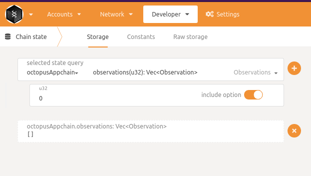

## Appchain Development Guide

In this tutorial, we will:

1. Setup the development environment for the Appchain;
2. Integrate an application into the Appchain;
3. Start the local network of the Appchain;

### Setup the Development Environment of the Appchain

It's suggested to start an Appchain node based on the [Barnacle](https://github.com/octopus-network/barnacle) which is a template developed by the Octopus Network team. Based on the [Substrate node template](https://github.com/substrate-developer-hub/substrate-node-template), Barnacle is a minimal working Appchain node template for developers to quickly start their own Appchain. The frontend of the Appchain can be developed based on the [Front-end template](https://github.com/substrate-developer-hub/substrate-front-end-template).

#### Setup a Rust Development Environment.

Note: Substrate development is easiest on Unix-based operating systems like macOS or Linux and it is highly recommended to use Windows Subsystem Linux (WSL) and follow the instructions for Ubuntu/Debian.

For most users, you can execute the following commands to install the environment.

`curl [https://getsubstrate.io](https://getsubstrate.io/) -sSf | bash -s - --fast`

For more information, please refer to the [Installation Guide](https://substrate.dev/docs/en/knowledgebase/getting-started/) in the Substrate Developer Center.

#### Install the Barnacle Template.

```yaml
git clone --depth 1 https://github.com/octopus-network/barnacle.git
cd barnacle
cargo build
```

#### Install the front-end template.

```yaml
# Install Node.js
curl -o- https://raw.githubusercontent.com/nvm-sh/nvm/v0.38.0/install.sh | bash
nvm install node
# Install Yarn
npm install --global yarn
# Clone the frontend template from github
git clone -b v3.0.0+monthly-2021-08 --depth 1 https://github.com/substrate-developer-hub/substrate-front-end-template
# Install the dependencies
cd substrate-front-end-template
yarn install
```

> **Note**
>
> If there is a newer version of `substrate-front-end-template`, It is recommended to replace `v3.0.0+monthly-2021-08` with it in the above command.

### Integrate Your Application into the Appchain

Steps to integrate your application into the Appchain([Barnacle](https://github.com/octopus-network/barnacle)):

1. Add a `pallet`, and implement application specific logic in `pallets/<pallet-name>/src/lib.rs`;
2. Add the `pallet` into `runtime/Cargo.toml`, `runtime/src/lib.rs`;
3. Add the `runtime` into `node/Cargo.toml`, install it in the node.

For more information, please refer to the [Add Pallet to Runtime Guide](https://substrate.dev/docs/en/tutorials/add-a-pallet/) in the Substrate Developer Center.

### Start the Local Network of the Appchain

Execute the following command to compile and start the local blockchain node:

```yaml
cargo build
# Run a temporary node in development mode
./target/debug/appchain-barnacle --dev --tmp
```

If you want to run a local front-end application to interact with local nodes, you can refer to [Run Local Front End](https://substrate.dev/docs/en/tutorials/create-your-first-substrate-chain/interact#start-the-front-end-template).

#### Custom Type

When the front end makes a Substrate RPC to retrieve data, the metadata(definitions of custom data type) is not returned. If there are custom data types defined in the runtime of the Appchain, we correspondingly need to submit the definitions of these data types in JSON format from the front end for the Polkadot JS to parse these data upon receiving.

#### Create a Custom Data Type
Here's an example of how to create a custom data type.
##### Example Custom Data Type in the Pallet
In the src/lib.rs under pallet-octopus-appchain, the type definition：
```rust
#[derive(Deserialize, Encode, Decode, Clone, PartialEq, Eq, RuntimeDebug)]
pub enum Observation<AccountId> {
	#[serde(bound(deserialize = "AccountId: Decode"))]
	UpdateValidatorSet(ValidatorSet<AccountId>),
	#[serde(bound(deserialize = "AccountId: Decode"))]
	LockToken(LockEvent<AccountId>),
}
```

##### Submit the Type Definition in Polkadot
Connect Polkadot JS to the Appchain, navigate to Settings -> Developer, add the following JSON data and save.
```json
{
  "Observation": {
    "_enum": {
      "UpdateValidatorSet": "(ValidatorSet)",
      "LockToken": "(LockEvent)"
    }
  }
}
```

##### Enquiry Custom Data
In Polkadot JS, navigate to Developer -> Chain State -> Storage -> octopusAppchain -> observations to query the custom data created:


