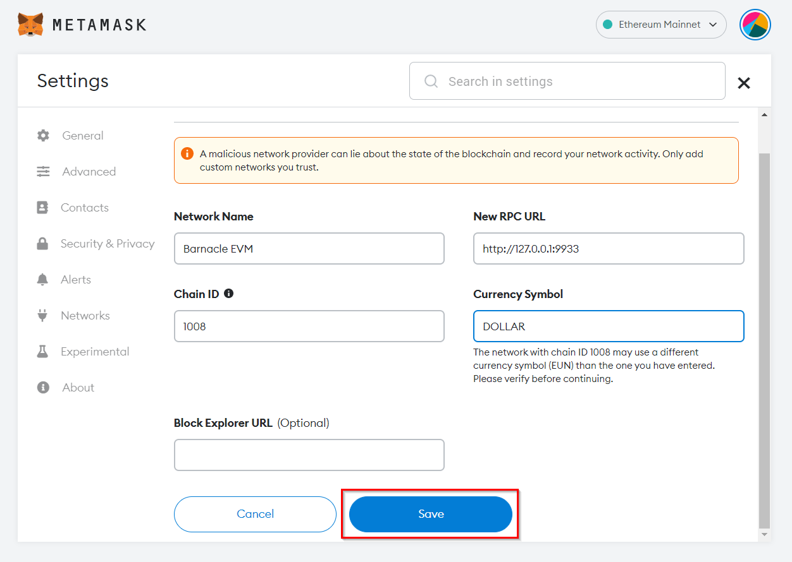
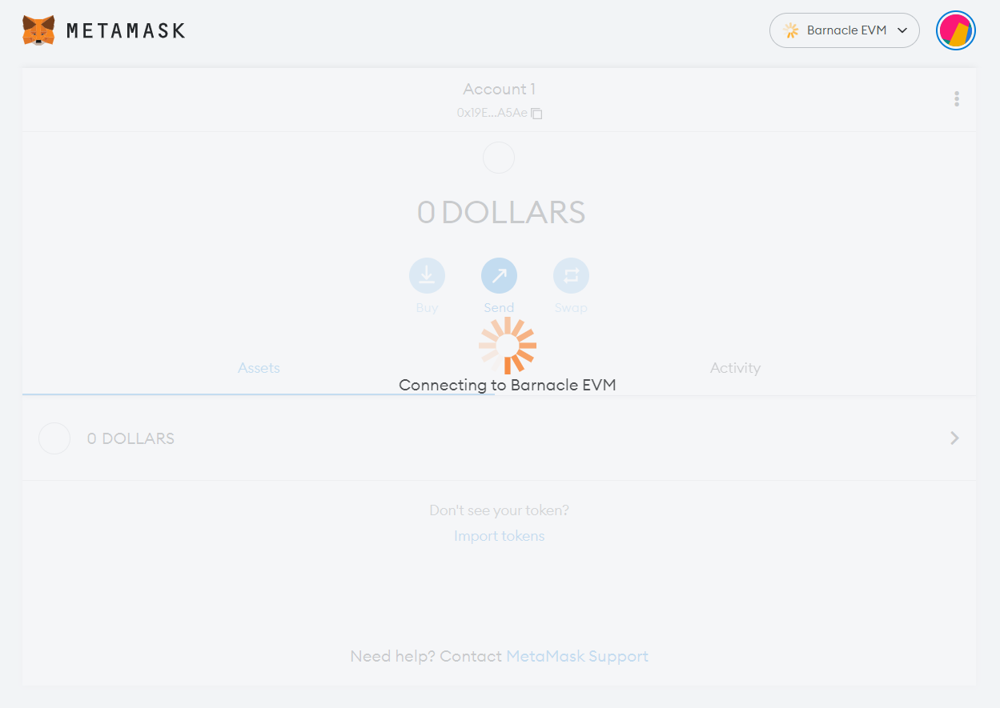
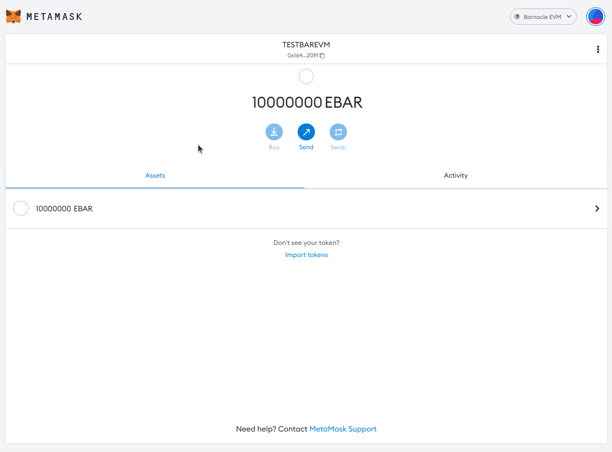

## Appchain EVM Compatible

The [Barnacle EVM](https://github.com/octopus-network/barnacle/tree/release-v0.9.18-evm) is an EVM compatible appchain development template provided by Octopus Network. It uses the [Frontier](https://github.com/paritytech/frontier) developed by Parity.

The developer team can use this template to develop an EVM-compatible Appchain. It supports the team directly deploying their DApp written by Solidity as an Appchain running in the Octopus Network. The Appchain benefits from being an autonomous blockchain. Also, it obtains what [Octopus Network](https://oct.network/) provides flexible leased security, out-of-the-box interoperability, rich infrastructure services, and an active community.

The Barnacle EVM Appchain is **Running** in the [Octopus Testnet](https://testnet.oct.network/appchains). The RPC connection of the Barnacle EVM Appchain:

* RPC: https://gateway.testnet.octopus.network/barnacle-evm/wj1hhcverunusc35jifki19otd4od1n5
* Chain Id: 1281
* Symbol: EBAR


## How to Use Octopus Barnacle EVM
 
### A walkthrough on how you can use Octopus Network's Barnacle EVM

Ethereum has become the Fat-Hub of the blockchain ecosystem. Follow the money - as they say. All interoperable blockchain projects that seek growth must connect to the Ethereum network because most Web 3.0 assets are there. Most independent blockchain projects have some EVM compatibility system in place. Some prefer bridges, and others create an EVM-compatible environment on their native chain. The goal of having an EVM-compatible Appchain is to streamline the environment for the validators and app users. App users use EVM toolsets like MetaMask, but validators still can use the Polkadot.js plugin wallet.

For example, Parity, the company behind Substrate, created the Frontier pallet to allow Substrate-based blockchains to have EVM compatible smart contracts within their Substrate blockchains. A Polkadot Parachain bases itself on the promise of 100% EVM compatibility, Moonbeam.

Octopus Network also supports a basic level of EVM compatibility. Because Appchains are Substrate chains on NEAR, you can use Parity's Frontier pallets directly in your Appchain. The base template of Octopus' EVM compatible blockchain is the [Barnacle EVM](https://github.com/octopus-network/barnacle/tree/release-v0.9.18-evm) using Parity's Frontier pallet.

To give you a better feeling of how it works, you can follow along in this tutorial.

### Setting Up A Local Barnacle EVM

Barnacle EVM is a great alternative to test your Solidity smart contracts on a local blockchain environment without having to deploy the contracts on a Testnet. 


First, you need to clone the original Barnacle repository:

```
git clone https://github.com/octopus-network/barnacle
```


Then, go into the cloned directory and enter the EVM branch.
```
cd barnacle
git switch release-v0.9.18-evm
```

The current version of the Barnacle EVM is v0.9.18, but it will increment future updates. You can check the active branches within the Barnacle repository for the most recent updates.

Barnacle EVM is a predisposed environment, and you don't need any fancy configurations. You can directly run the blockchain, and it will be ready to go!

```
cargo build --release
./target/release/appchain-barnacle --dev --enable-offchain-indexing true
```

When running the blockchain, don't forget to add the `--dev` flag to run locally.
For more details you can refer the document of [README](https://github.com/octopus-network/barnacle/blob/release-v0.9.18-evm/README.md).

Congratulations, you ran your first Barnacle EVM! You can connect directly to the EVM through `http://127.0.0.1:9933`.

> Note: use the port `9933`. It will be different from the default Substrate Websocket port `9944`.

### Deploying Contracts to the Barnacle EVM Using Hardhat

Deploying smart contracts to Barnacle EVM is easy. You can use the smart contract templates provided within `docs/example` to simplify the process. Hardhat is an Ethereum development environment built using NodeJS, so to use it, you would need to have NodeJS and NPM pre-installed.

Enter the `docs/example` repository, and install the dependencies using NPM:

```
cd docs/example
npm i
```

Within the directory, you will see a `contracts` and `.maintain` folder. You can see the ready-to-use smart contracts within the `contracts` folder. `.maintain` will house all the necessary scripts, including deployment and testing.

The Hardhat project template needs a `.env` file to function:

```
BARNACLE_RPC_URL=http://127.0.0.1:9933
BARNACLE_DEPLOYER_PRIVATE_KEY=*private key here*
BARNACLE_ACCOUNT_PRIVATE_KEY=*private key here*
```

There are three environment variables that you are required to supply. The environment variables are used in the `hardhat.config.js` file.

If you open the file, you will notice a `chainId` parameter. The `chainId` is for signing transactions within the network. Barnacle EVM `chainId` is `1281`. You can [view it here](https://github.com/octopus-network/barnacle/blob/release-v0.9.18-evm/runtime/src/lib.rs#L752).

After supplying the private keys, you need to print out your account addresses since the address will be different from other chains. You need to connect to Barnacle EVM and retrieve the addresses manually using a script.

```
npx hardhat run .maintain/print-addresses.js --network barnacle
```

Your command will print out the public addresses for your public keys:

```
Deployer private key account address: 0xf39Fd6e51aad88F6F4ce6aB8827279cffFb92266
Executor private key account address: 0x70997970C51812dc3A010C7d01b50e0d17dc79C8
```

You can modify the snippet below within the [`node/src/chain_spec.rs`](https://github.com/octopus-network/barnacle/blob/release-v0.9.18-evm/node/src/chain_spec.rs) file to add your pre-funded accounts.

```rust
// Pre-funded accounts
Some(
  vec![AccountId::from_str("f24FF3a9CF04c71Dbc94D0b566f7A27B94566cac").unwrap()],
)
```
Also, you can modify the sudo account as you need.

```rust
// Sudo account
AccountId::from_str("f24FF3a9CF04c71Dbc94D0b566f7A27B94566cac").unwrap(),
```

Note that there are two identical configurations in the file, but the difference is the running environment. Modify the configurations in `development_config()` if you run as development environment. Modify the configurations in `local_testnet_config()` if you run as local testnet environment.

Then, go to your project's root directory, rebuild the Barnacle EVM and deploy the smart contracts:

```
cd ~/*work directory*/barnacle
cargo build --release
./target/release/appchain-barnacle --dev --enable-offchain-indexing true
cd docs/example
npx hardhat run .maintain/deployment.js --network barnacle
```

The deployment script also has tests in them, and it should return something like this:

```
Deploying to network barnacle http://127.0.0.1:9933
Deploying contracts with the account: 0x4FF637E5326Ff581E8F62cd66BD116dd27Ac800B
Executor contracts with the account: 0x19Ee2F7736Dcb4A76d567F35bfEf55aE24f7A5Ae
Contracts deployed!
Deployed ERC20 contract address 0xfBAf19640F23b36Df6d4d599aB8bCf2C92f95D69
Deployed Escrow Contract address 0x5a51cE149EcD3312C994Febaae69E4Beb939A0c6
Approved smart contract!
Executor Account Balance:  340282366920938463462374562926906777218
Executor ERC20 Account Balance:  80000000000000000000
Executor ERC20 Account Balance:  50000000000000000000
Executor ERC20 Account Balance:  80000000000000000000
```

There you go! You deployed your first (two) smart contracts on Barnacle EVM, an ERC20 token, and a simple escrow smart contract.

You can interact with your smart contract like in any other network using `ethers.js`; you can look to the `.maintain/deployment.js` script for examples.

### How to Connect Barnacle EVM to MetaMask

You can connect your MetaMask account to Barnacle EVM.

First, you need to open MetaMask find the "Add Network" button.


Then fill in the Barnacle EVM details. Name the network "Barnacle EVM", then insert the default Barnacle EVM RPC "http://127.0.0.1:9933".

The chain ID of this particular Barnacle EVM is [1281](https://github.com/octopus-network/barnacle/blob/release-v0.9.18-evm/runtime/src/lib.rs#L752).

The barnacle EVM token named "EBAR" defaultly. However, you can also name the native token whatever you like.

After you filled in the form, click "Save".



You might need to wait a second for the MetaMask to connect.

<!--  -->

If you are successfully connected you should see your default funds.



Barnacle EVM uses H160 addresses and is compatible to the Ethereum EVM you can use your Ethereum wallet private keys on Barnacle just fine.

### Conclusion

The Barnacle EVM is the basis template for your EVM compatible Appchain. You can deploy your smart contracts in Barnacle EVM for testing just like any other Testnet environment.

You can use any Ethereum development tools to interact with Barnacle EVM. In this walkthrough, you used Hardhat. But there are other environments that you can use, including Truffle, Remix, Brownie, and many more. You can read other examples in the Moonbeam docs.

Need more tutorials? Please refer to the [tutorials](https://docs.moonbeam.network/builders/build/eth-api/) from the Moonbeam Docs.
