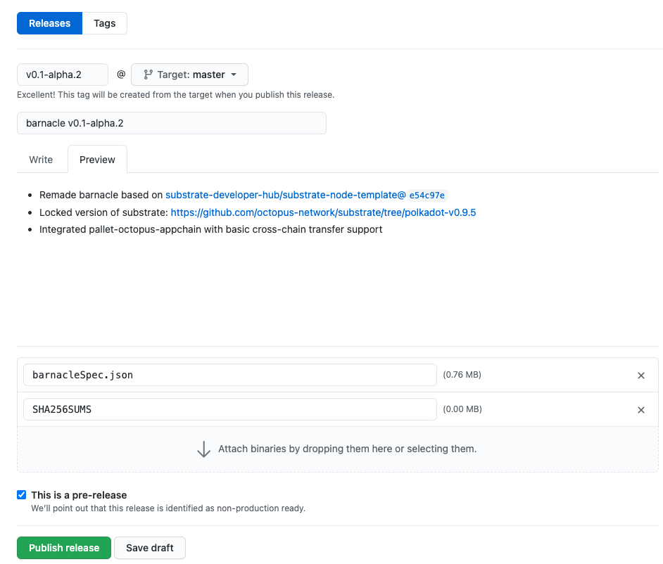

## Appchain Release

The Appchain based on Barnacle has integrated the `pallet-octopus-appchain`, once finishing the Appchain development, it can be released, and then the team could prepare to register the Appchain into the Octopus Network.

Steps to release the Appchain:

1. Compile the Appchain and generate the Chain Spec
2. Publish the Appchain release

### Compile the Appchain and Generate the Chain Spec

**Note**: Prior to compiling, the Appchain team should globally search for the keyword **barnacle** and replace it with your Appchain's name. Additionally, in the file `runtime/src/lib.rs`, please make sure that the value of `spec_name` is `appchain` and `spec_version` is greater than `100`:

```Rust
#[sp_version::runtime_version]
pub const VERSION: RuntimeVersion = RuntimeVersion {
	spec_name: create_runtime_str!("appchain"),
	...
	spec_version: 101,
	...
};
```

Generate the Chain Spec file and hash by the following commands(use Barnacle as an example):

```bash
git clone --depth 1 https://github.com/octopus-network/barnacle.git
cd barnacle
# this will take a while!
cargo build --release

# Generate the chainspec file, feel free to use any filename you wish
./target/release/appchain-barnacle build-spec --disable-default-bootnode --chain dev> barnacleSpec.json 
# Generate sha256 hash
sha256sum barnacleSpec.json> SHA256SUMS
```

### Publish the Appchain Release

Before registering the Appchain, the Appchain team needs to publish a release of the Appchain, which includes the human-readable ChainSpec file generated above.


