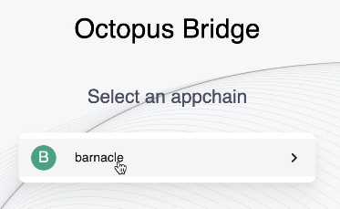

## Transfer Appchain Token to Mainchain

This guide describes how to transfer Appchain's native token between Appchains and mainchain. 

We will cover the 3 topics below, employing Appchain "Barnacle" and its native token "BAR" as examples:

* Create wrapper token on Near
* Transfer Appchain's native token from Appchain to mainchain
* Redeem Appchain's native token from mainchain to Appchain 

### Create Wrapper Token on NEAR

After an Appchain goes live, if the Appchain users want to use the Appchain's native token on the mainchain, the contract of the corresponding wrapper token, a NEP-141 asset, must be deployed on the mainchain beforehand.  

Appchain teams may refer to the [sample contract](https://github.com/octopus-network/appchain-native-token) as a guide to set up a wrapper token on the mainchain. 

### Transfer Appchain's native token from Appchain to mainchain

On the [Octopus testnet bridge](https://bridge.testnet.oct.network/), we select  Barnacle as the Appchain in the cross-chain transfer.

Select the Appchain's account as the sender.

> Note: If your Appchain account doesn't have a balance of BAR, You may transfer some BAR from Appchain's built-in account ALICE to your account via Polkadot.js.

Set the NEAR account hellocto.testnet as the receiver and fire the transaction.

### Redeem Appchain's native token from mainchain to Appchain

Following the previous operation, we switch the sender and receiver to redeem the Appchain's native token back to the Appchain.

