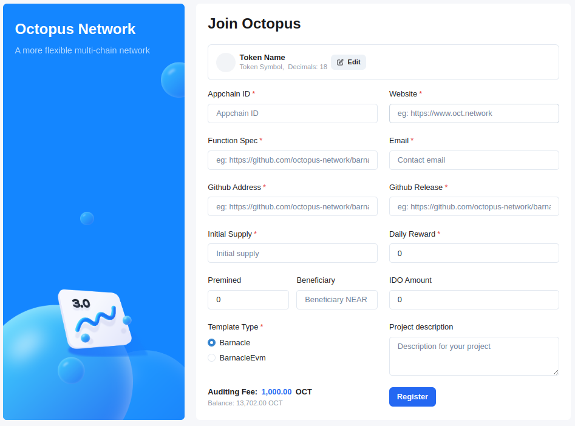

## Appchain Register

### Appchain check items

This section aims to list the items that the appchain team needs to check before appchain registration to ensure a smooth launch.

+ The appchain is using the latest version of the barnacle/barnacle-evm template
+ The version of Substrate used in Cargo.toml of appchain should be consistent with the template.
+ The runtime code should be consistent with the definition of the integrated Pallets in the template construct_runtime!

```rust
construct_runtime!(
	pub enum Runtime where
		Block = Block,
		NodeBlock = opaque::Block,
		UncheckedExtrinsic = UncheckedExtrinsic
	{
		System: frame_system,
		Babe: pallet_babe,
		Timestamp: pallet_timestamp,
		Authorship: pallet_authorship,
		Balances: pallet_balances,
		TransactionPayment: pallet_transaction_payment,
		OctopusAppchain: pallet_octopus_appchain, // must before session
		OctopusLpos: pallet_octopus_lpos,
		OctopusUpwardMessages: pallet_octopus_upward_messages,
		OctopusAssets: pallet_assets::<Instance1>,
		Session: pallet_session,
		Grandpa: pallet_grandpa,
		ImOnline: pallet_im_online,
		Historical: pallet_session_historical::{Pallet},
		Mmr: pallet_mmr,
		Beefy: pallet_beefy,
		MmrLeaf: pallet_beefy_mmr,
		Uniques: pallet_uniques,
		Sudo: pallet_sudo,
		// Include the custom logic from the pallet-template in the runtime.
		TemplateModule: pallet_template,
	}
);
```

+ The block generation time of the appchain is consistent with the template, set to 6s.

```rust
pub const MILLISECS_PER_BLOCK: Moment = 6000;
pub const EPOCH_DURATION_IN_BLOCKS: BlockNumber = 4 * HOURS;
```
+ In appchain Spec JSON file, ss58Format is 42, if you do not need to transfer the stablecoin assets (USDN) of the main chain (NEAR network) to appchain, please configure assetIdByTokenId to be empty.

```
"assetIdByTokenId": []
```

+ During appchain registration, the Token Icon of provided by appchain must be in SVG format.

### Prerequisites

* NEAR account
* OCT token: The Appchain team needs pay 1k OCT tokens as an **Auditing Fee**. For the testnet, the Appchain team can request OCTs from Discord.

### Steps of Appchain Registration

1. Log in to the Octopus apps via a NEAR account.
2. Click the **Join Octopus** button, and then fill in the following information:
    * **Appchain ID**: 3-20 characters consisting of lowercase letters, numbers and hyphen `-`, and cannot start with a number, and a hyphen `-` cannot be used at the beginning and end, a.k.a the regular expression: `[a-z]([-a-z0-9]*[a-z0-9])?` 
    * **Token Info**
        - **Token Name**: The name of the Appchain native token
        - **Token Symbol**: The symbol of the Appchain native token
        - **Icon**: The **SVG** format icon link of the Appchain native token
        - **Decimals**: The decimals of the Appchain native token
    * **Website**: The official website of the Appchain
    * **Function Spec**: The url of the Appchain functional specification file
    * **Github**: The Github repository of Appchain
    * **Github Release**: The Github URL of the release of the Appchain
    * **Initial Supply**: The Appchain native token amount of the initial issues
    * **Premined**: The number of wrapped tokens that be Premined to the NEAR network in the total initial issuance
    * **Beneficiary**: The NEAR account to receive the Premined wrapped token
    * **IDO Amount**: The number of tokens used by the Appchain team to use Skyward for IDO before the Mainnet launch
    * **Era Reward**: The Appchain native token amount as its block reward for each day (1 era = 1 day)
    * **Email**: The contact email of the Appchain

   

3. Click *Submit* to send the registration request.
