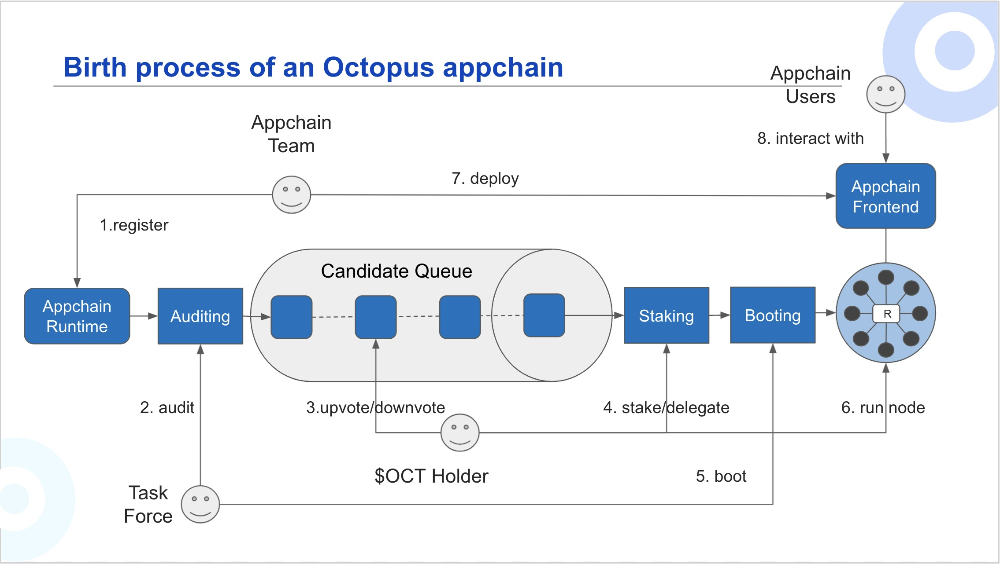

## Appchain Startup

During the whole Appchain startup process, there are four phases:
1. **Auditing**: Once the appchain [registration](./appchain-register.md) is completed, the Octopus team will start the audit within 1-2 weeks. During the Auditing phase, the Octopus team mainly audits for two aspects:
    * Whether there are known security vulnerabilities in the Substrate codes;
    * Whether the implementation of Appchain is consistent with its specification or white paper.
2. **InQueue**: If the Appchain passes the audit, it will go through the InQueue phase. This is the **critical stage** for the Appchain team to request support from OCT holders. OCT holders can [vote](./voting-appchain.md) to decide whether the Appchain would go through the next phase.
3. **Staging**: The Appchain with the highest vote scores will go through the Staging phase, which is the pre-launch stage of the Appchain network. There will only be one Appchain at this phase. The Appchain team needs to encourage OCT holders to be the [validator](../maintain/validator-guide.md) of their network, and OCT holders can run the validator node and stake OCT.
4. **Booting**: When the Appchain obtains enough validator nodes, the Octopus team will run several validator nodes as the booting nodes of the Appchain network, and then the Appchain will go through the Booting phase.

> Notes:
> * An appchain network only needs 7 validator nodes to startup, Octopus Foundation will run 4 boot-nodes for each appchain, and those boot-nodes will not accept delegation.
> * To be a validator, the minimum amount of stake OCT is 10,000;

### Step by Step: Appchain Onboarding

Taking the testnet as an example, the steps to start the appchain are as follows:
1. Login to funded NEAR web wallet account, containing OCT and NEAR tokens.
2. Navigate to [Octopus Test Network](https://testnet.oct.network) and click "Join Octopus".
3. Fill in the forms with the desired project name and GitHub details for [appchain registration](./appchain-register.md), and click "Submit".
4. After the registration is passed, when the audit process starts, the UI will mark the appchain as **Auditing** phase. This means the audit is active with the Octopus Network team and no feedback will be presented until complete. Octopus Network reserves the right to protect the network through this process, so please be patient: projects that are acceptable but need corrections will not be rejected if the submitter is willing to adjust their Github repositories.
5. Once the audit is completed, the UI will mark the appchain as **InQueue** phase. This means the OCT holder could [vote](./voting-appchain.md) for the appchain.
6. The voting will take about 1-2 weeks, and then the UI will mark the appchain with the highest vote scores as **Staging** phase. This means the OCT holder could be stake OCT to be the [validator](../maintain/validator-guide.md) of the appchain.
7. The appchain goes through the **Booting** phase, its network will produce new blocks and allow new validator nodes to join. The appchain team can configure its front end to connect to the gateway through an RPC endpoint, and users can use its application.

🎉🎉🎉 Congratulations! If you've made it this far, you are now part of the Octopus Network! As an appchain partner, your leased security is valid as long as the community continues to support the project with staking OCT tokens. If you have any questions, please reach out to us on [Discord](https://discord.gg/6GTJBkZA9Q). If you don't have your own appchain channel there, please contact `sheldon@oct.network` to affirm your registration and keep a channel open for your appchain in our Octopus Network community.
