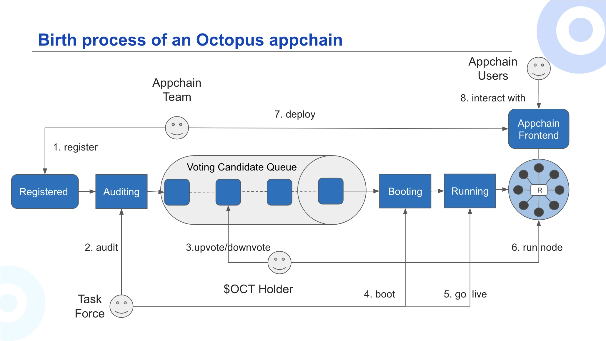

## Appchain Startup



### Appchain Status

There are the below five phases:

1. **Registered**: The appchain will go through the Registered phase after the appchain team submits the registration with the appchain information.
2. **Auditing**: The Octopus team will start the audit within 1-2 weeks. During the Auditing phase, the Octopus team mainly audits for two aspects:
    * The protocol functions are usable/valuable for business purposes;
    * Both the protocol apps and appchain node are implemented as the same with the protocol function specification file provided;
3. **Voting**: If the appchain passes the audit, it will go through the Voting phase. This is the **critical stage** for the appchain team to request support from OCT holders. OCT holders can [vote](./voting-appchain.md) to decide whether the appchain would go through the next phase.
4. **Booting**: The appchain with the highest vote scores will go through the Booting phase, the Octopus team will do some preparations for the appchain to go live.
5. **Running**: After the Octopus team boots the appchain and the appchain team activates the chain with the Sudo account,  the Octopus team will execute the go-live step, the appchain will go through the Running phase.

### Appchain booting process

When an appchain is ready to boot, the Octopus team moves it to the booting phase. In this section, we will list what we need to do during **Booting** phase.

1. The Octopus team deploy an anchor contract and a wrapped token contract for the appchain.

    **Note**: By creating the wrapped token in NEAR network early, the appchain team can choose to do an IDO before the appchain launches. The appchain's tokens exist in two places, wrapped token in NEAR network and appchain native token in Appchain network. When an appchain is launched, users can use the Octopus Bridge to transfer tokens between these two places.

    Also, the Octopus team will provide a snippet of the chainspec file that contains the session keys and staking information of the Octopus foundation validator nodes. For the foundation validator nodes, the default staking amount is `10000 * 10**18` OCT, and for these nodes, the default pre-allocated balance of natvie token is `10 * 10**18`, and the actual amount is determined by the appchain team.

2. The Appchain team generate a human-readable chainspec file. Example command:

   ```bash
   ./target/debug/debio build-spec --disable-default-bootnode --chain dev > debionetwork.json
   ```

   And then please carefully copy the snippet information provided from the Octopus team into the chainspec file. Example:

   ```bash
   
   // check this section, the Octopus foundation validator nodes are allocated a small balance to cover transaction fees (for example, 10 $DBIO)
      "balances": {
       "balances": [
        [
         "5GrwvaEF5zXb26Fz9rcQpDWS57CtERHpNehXCPcNoHGKutQY",
         10000000000000000000
        ],
      ...
      },
      
   // this can be found on mainnet/testnet website   
   "anchorContract": "debionetwork.octopus-registry.near", 
   "eraPayout": 13699000000000000000000,
   
   // check this section, these are session keys of the Octopus foundation validator nodes
      "session": {
       "keys": [
        [
         "5GrwvaEF5zXb26Fz9rcQpDWS57CtERHpNehXCPcNoHGKutQY", 
         "5GrwvaEF5zXb26Fz9rcQpDWS57CtERHpNehXCPcNoHGKutQY", 
         {
          "babe": "5GrwvaEF5zXb26Fz9rcQpDWS57CtERHpNehXCPcNoHGKutQY", 
          "grandpa": "5FA9nQDVg267DEd8m1ZypXLBnvN7SFxYwV7ndqSYGiN9TTpu", 
          "im_online": "5GrwvaEF5zXb26Fz9rcQpDWS57CtERHpNehXCPcNoHGKutQY", 
          "beefy": "KW39r9CJjAVzmkf9zQ4YDb2hqfAVGdRqn53eRqyruqpxAP5YL", 
          "octopus": "5GrwvaEF5zXb26Fz9rcQpDWS57CtERHpNehXCPcNoHGKutQY" 
         }
        ],
    ...
       ]
      },
   
   // add a sudo account for future upgrades and privileged operations.(Don’t forget to add some balance to this account as well.)
      "sudo": {
       "key": "5GrwvaEF5zXb26Fz9rcQpDWS57CtERHpNehXCPcNoHGKutQY"
      }
   ```

    Also, the Appchain team should generate a raw chain spec and named it as `octopus-mainnet.json` for mainnet or `octopus-testnet.json` for testnet, and then commit it to the appchain Github repo (e.g. <APPCHAIN_REPO>/resources/). Example command:

    ```bash
    $ ./target/debug/debio build-spec --chain=debionetwork.json --raw  > octopus-testnet.json
    ```

    At the same time, please send the human-readable chainspec file to Discord, the Octopus team need to do a double check.

   > **Note**: Check the appchain node, the `load_spec` function in the file `<APPCHAIN_REPO>/node/src/command.rs`, whether the following content is added to set the option `--chain` value:
    > * for mainnet, use `octopus-mainnet`
    > * for testnet, use `octopus-testnet`

   The example code in the Barnacle template is as follows:
   
    ```Rust
    "octopus-testnet" => Box::new(chain_spec::octopus_testnet_config()?),
    ```    

3. The Octopus team use the code appchain team released to build a docker image, and then will launch a four-validators + four-bootnodes chain, deploy the API gateway, relayer and other services, and then send the wss endpoint of API gateway to the Appchain team.

4. The Appchain team connect the polkadotjs apps with the wss endpoint, and then use `sudo` account to activate the appchain, do the `sudo` call `octopusAppchain -> forceSetIsActivated` with `yes`.

5. The Octopus team move the appchain to the running stage.