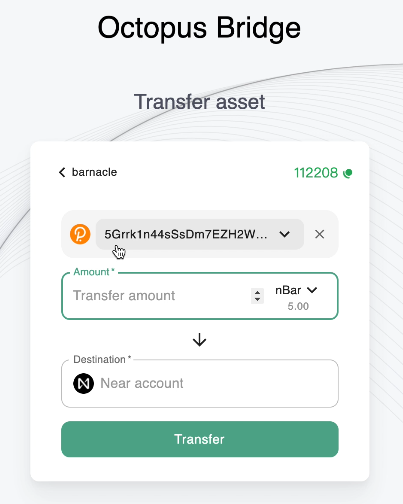
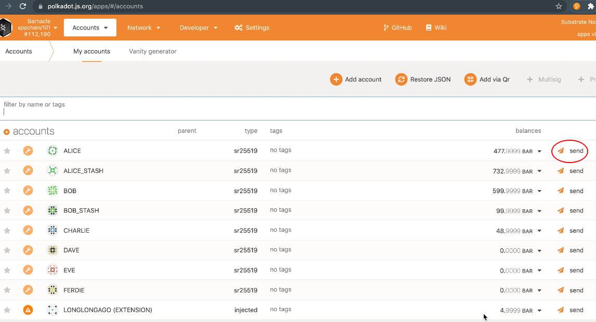
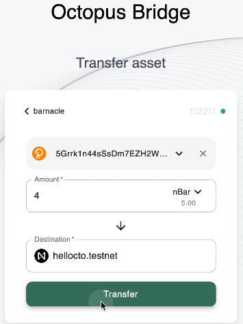
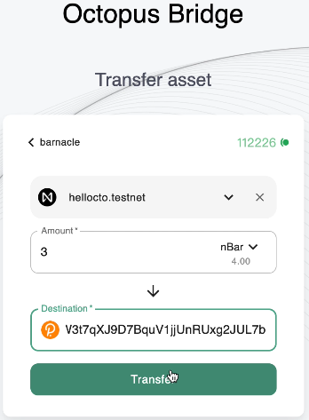

## Assets Cross-chain

The Octopus Network provides out-of-the-box cross-chain functions for Appchain, including to transfer main chain (NEAR) stablecoin and to Appchain native asset.
* Transfer Appchain Token to Mainchain
* Transfer Mainchain Token to Appchain

## Transfer Appchain Token to Mainchain

This guide describes how to transfer Appchain's native token between Appchains and mainchain.

We will cover the 3 topics below, employing Appchain "Barnacle" and its native token "BAR" as examples:

- Create wrapper token on Near
- Transfer Appchain's native token from Appchain to mainchain
- Redeem Appchain's native token from mainchain to Appchain

### The limitation for the cross-chain transfer

- NEAR -> Appchain: the total market value of all non-appchain native tokens is not higher than 1/3 of the total market value of the OCT token staking in the anchor contract of the appchain.

### Create Wrapper Token on NEAR

After an Appchain goes live, if the Appchain users want to use the Appchain's native token on the mainchain, the contract of the corresponding wrapper token, a NEP-141 asset, must be deployed on the mainchain beforehand.

Appchain teams may refer to the [sample contract](https://github.com/octopus-network/appchain-native-token) as a guide to set up a wrapper token on the mainchain.

### Transfer Appchain's native token from Appchain to mainchain

On the [Octopus testnet bridge](https://testnet.oct.network/bridge), we select Barnacle as the Appchain in the cross-chain transfer.


Select the Appchain's account as the sender.



> Note: If your Appchain account doesn't have a balance of BAR, You may transfer some BAR from Appchain's built-in account ALICE to your account via Polkadot.js.



Set the NEAR account hellocto.testnet as the receiver and fire the transaction.



### Redeem Appchain's native token from mainchain to Appchain

Following the previous operation, we switch the sender and receiver to redeem the Appchain's native token back to the Appchain.



## Transfer Mainchain Token to Appchain

Octopus Network provides out-of-the-box cross-chain functions for Appchains, including mainchain (NEAR) stablecoin transfer and Appchain native asset transfer.

This guide describes how to transfer the mainchain's stablecoin through Octopus' built-in cross-chain function.

- Create stablecoin's wrapper asset on Appchain
- Transfer stablecoin to Appchain
- Transfer stablecoin's wrapper asset to mainchain from Appchain

### Create Wrapper Assets

After the Appchain goes live, if Appchain users want to use a stable coin on the mainchain, such as USDC, we need to create the corresponding wrapper asset on the Appchain first. Usually, this step is done through the governance of the Appchain. However, we use `sudo` instead to demo.

- Connect to the Appchain on Polkadot JS.
- Set the custom type, select `Settings -> Developer`, add the following JSON content and save it:

```json
{
  "Validator": {
    "id": "AccountId",
    "weight": "u128"
  },
  "ValidatorSet": {
    "sequence_number": "u32",
    "set_id": "u32",
    "validators": "Vec<Validator>"
  },
  "LockEvent": {
    "sequence_number": "u32",
    "token_id": "Vec<u8>",
    "sender_id": "Vec<u8>",
    "receiver": "AccountId",
    "amount": "u128"
  },
  "AssetIdOf": "u32",
  "AssetBalanceOf": "u128",
  "TAssetBalance": "u128",
  "Observation": {
    "_enum": {
      "UpdateValidatorSet": "(ValidatorSet)",
      "LockToken": "(LockEvent)"
    }
  }
}
```


- Select `Develper -> Sudo -> assets -> forceCreate` to issue an asset with asset ID 0:


- Check the chain status if the asset was issued correctly, where Asset 0 corresponds to the stable coin USDC on the mainchain (we have this mapping preset in ChainSpec, `usdc.testnet`).

### Transfer Mainchain to Appchain

On the [cross-chain bridge](https://testnet.oct.network/bridge) of Octopus Test Network, we select the Appchain `easydeal-demo` which will receive the stablecoin USDC transferred from the mainchain and the account `oct.testnet` as the sender; The recipient is an SS58 address of an Appchain account, which will receive the 2 USDC after transferred.


A few minutes later, the transfer transaction is verified by the Appchain validators, then the corresponding wrapped assets are minted for the recipient. We can check the chain state to verify if the assets are transferred correctly by selecting `Chain State -> Storage -> assets -> account` and the balance should be 2,000,000 units(note: the decimal place is 6).


### Transfer Back to the Mainchain from Appchain

Following to the previous operation, we switch the sender and receiver accounts to transfer the stablecoin asset back.


The asset balance will be updated after the transfer back event is verified by Octopus Relay on the mainchain.
