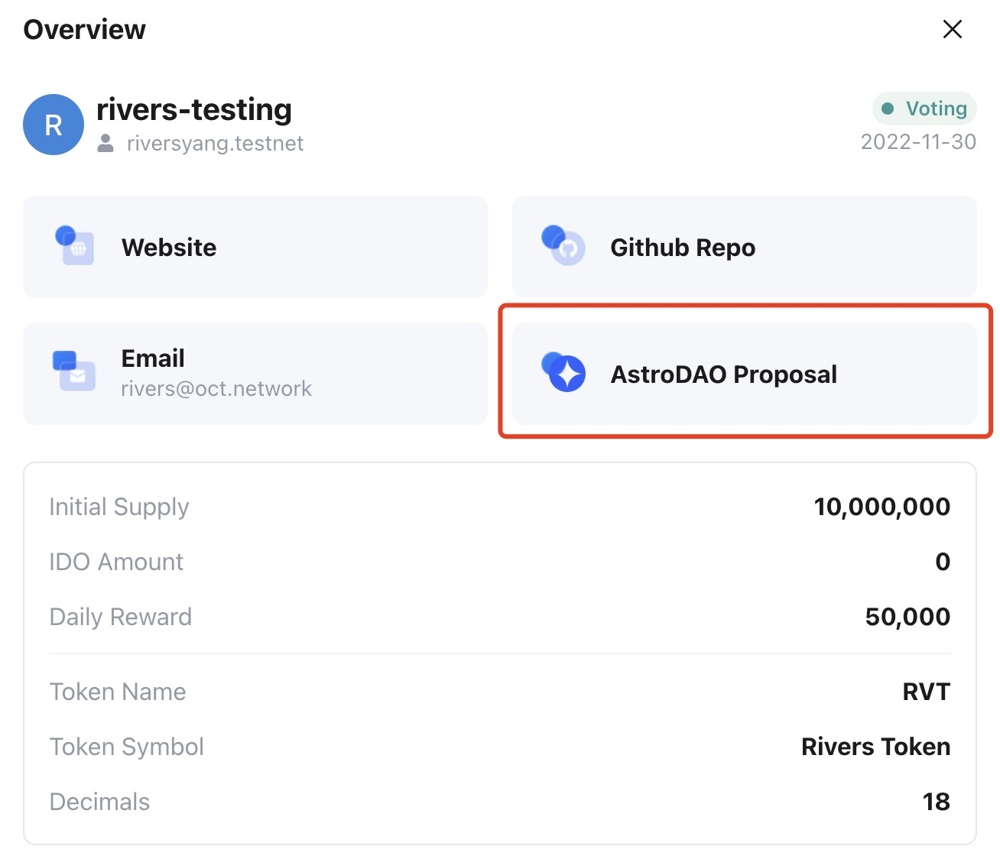
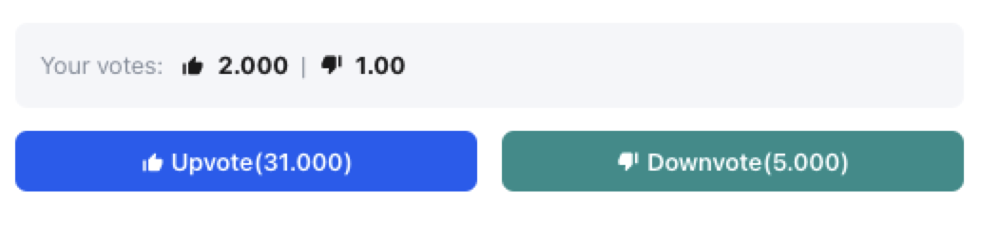

## Voting for Appchain

For the Appchains in the **Voting** phase, all OCT holders can upvote or downvote an apphain. The Appchain which gets the highest scores will be promoted into the next phase. The voting steps are as follows:

1. Log in to the Octopus Apps [Mainnet](https://mainnet.oct.network) via your NEAR account.
2. Navigate to the **Appchains** page and select an Appchain in the **Voting** and click it, and then click the **AstroDAO Proposal**.
3. Open the **AstroDAO Proposal** page and connect your NEAR account, vote Upvote or Downvote.

> Notes:
>
> Please complete the vote before the validity period of the proposal, which is 7 days by default.