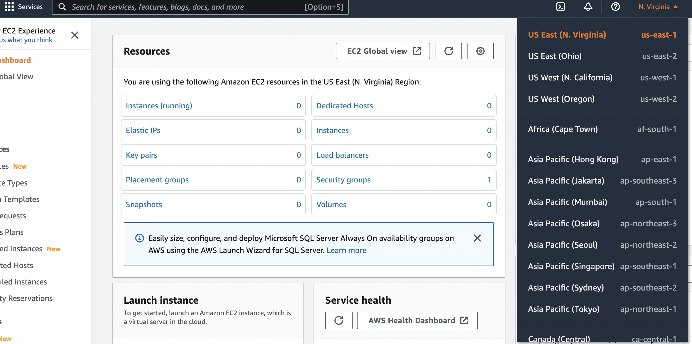
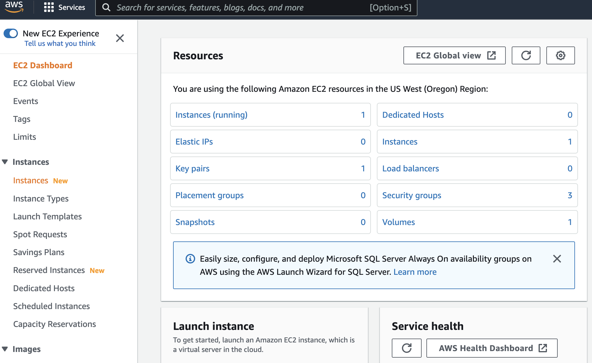
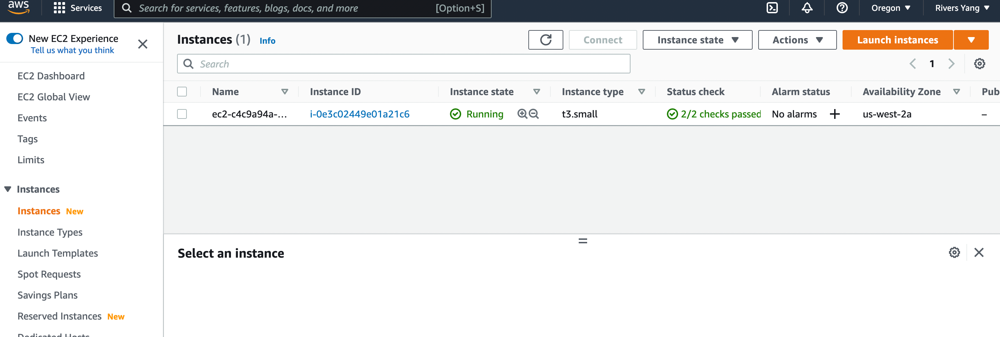
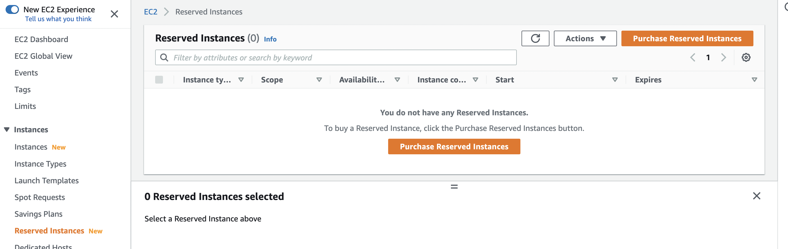
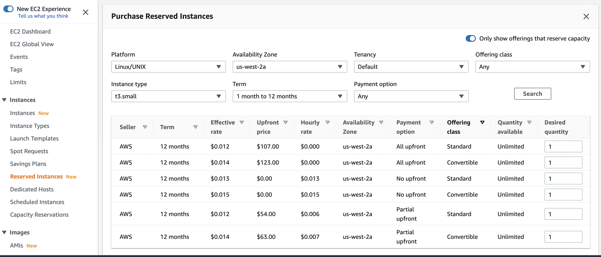

## AWS EC2 cost optimization

Cost optimization while using AWS auto deployment of Octopus Network appchain validator. First, we need to find our auto deployed EC2 instance in AWS console. Select [EC2] in the menu [Services].

Then switch the region manually on the top-right menu to find out which region the auto deployed EC2 instance is in.

Once find the instance in [EC2 Dashboard], select [instances] on the left menu.

Remember the [Instance type] and [Availability Zone] of the EC2 instance.

Switch to [Reserved Instances] on left menu.

[Purchase Reserved Instances] by turn on [Only show offerings that reserve capacity
] on the top-right corner and specify [Availability Zone] and [Instance Type] that exactly matched the auto deployed EC2 instance. We can also specify the [Term] on demand.

Then we can add a plan to cart and finish the purchase. The reserved instances can reduce about 30% (with Convertible Offering) or 40% (with Standard Offering) cost of the EC2 instances. (Compare: the on-demand price for this type of EC2 instance is $0.0208 per hour, aka. $182 per year.)

The cost of reserved instances will cover the cost of on-demand instances in the term we selected. As it is not bonded to instance id, we can freely release/create EC2 instances on demand.

Although the total cost of using EC2 instances are also including the cost of EBS (data storage) and data transfer (network traffic), the reserved instanced is still a good option to reduce the over-all cost of being an appchain validator.
