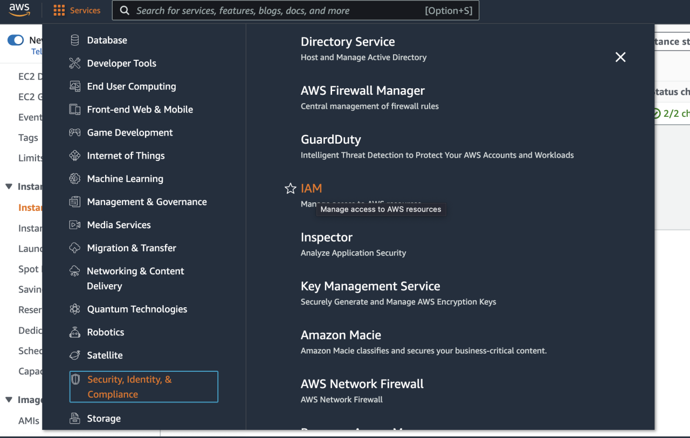
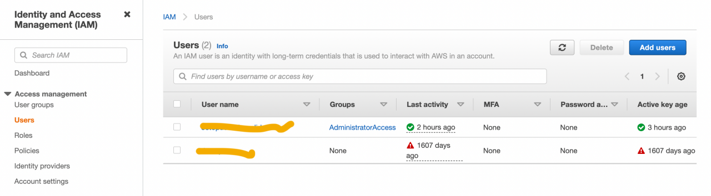
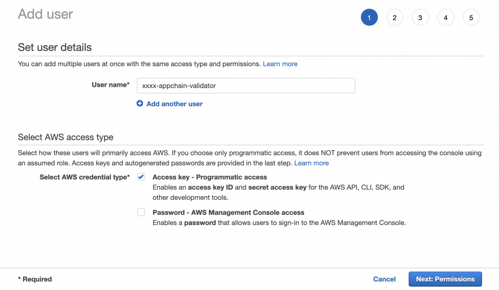
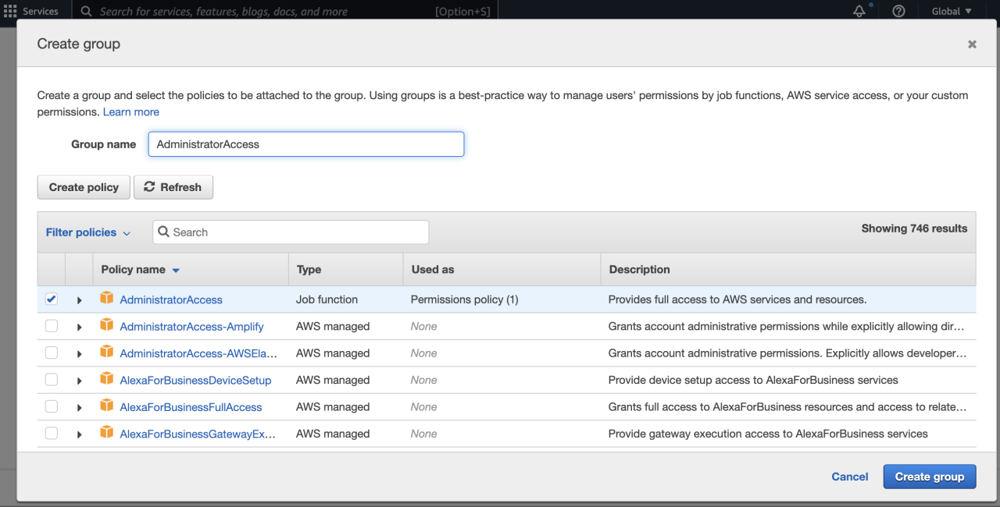
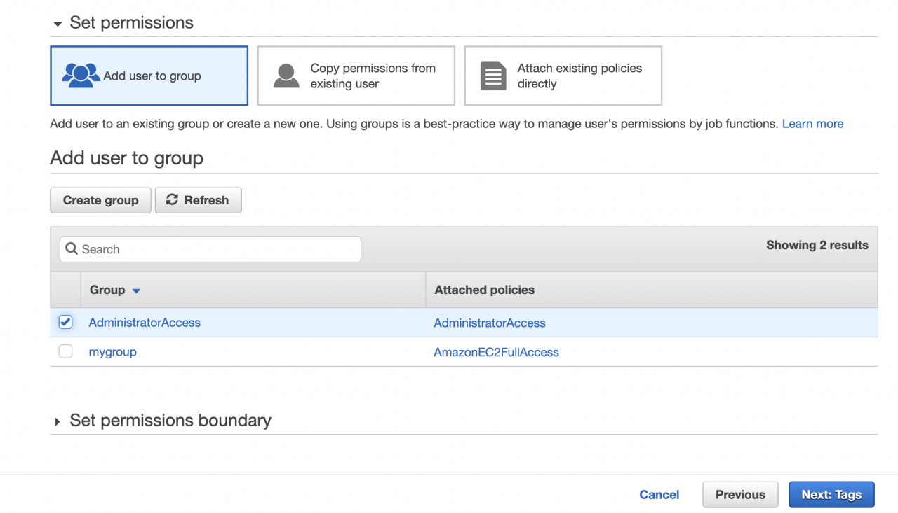
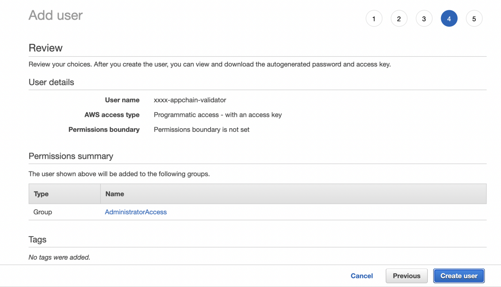
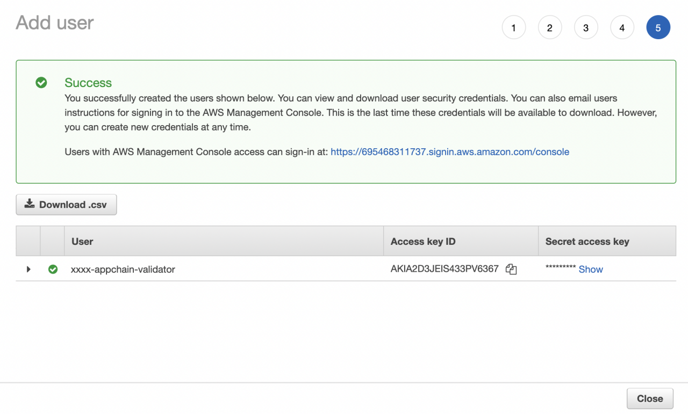

## AWS New User

As it is not recommended to use access key of root user to perform automated deployment, we should create a new user in AWS IAM.

Login with the root user and select [IAM] from the [services] menu.

Use [Add users] to create new users.

Specify [User name] and check on [Access key], go to [Next].

Create a new group with policy [AdministratorAccess] if it is not existed.

Select [Add user to group] and check on the new created group with attached policies [AdministratorAccess]. Go to [Next].

Complete the following steps and create the user.

Remember to download and store the csv file properly. It contains the access key id and the secret access key that will be used in following actions.

