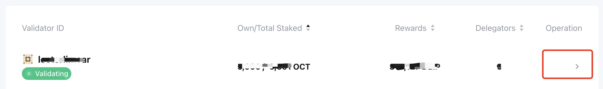
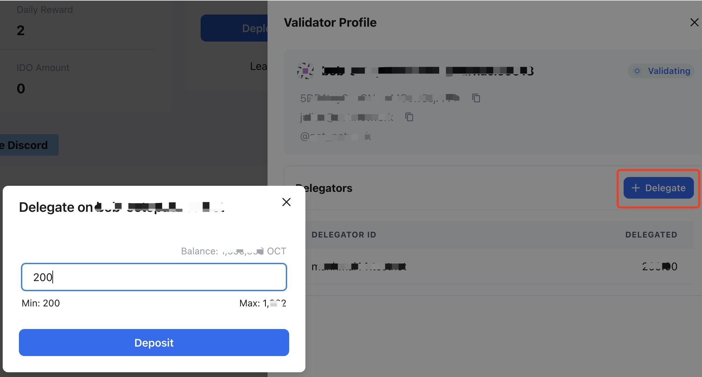

## How to Delegate

Delegators are one type of participant in the [Staking]((../general/octopus-staking.md)) of Octopus Network. They are able to obtain the staking rewards by delegating their OCT to another type of participant - validators. 

> The delegator does not need to run a validator node, but when looking for a validator to delegate, the delegator should check the stability of the validator node. If there is a problem with the validator, the delegator will not be able to obtain staking rewards.

The delegation steps are as follows:

1. Log in to Octopus Network [V2 Mainnet](https://v2-interface-ten.vercel.app/) with your NEAR account, click the **Appchains** tab, select the appchain which you would like to do the staking, and then click it to open the appchain page.

2. Select the validator you want to delegate from the **Validators** list, and then click it to open the `Validator Profile` page.

3. Click the `+ Delegate` button on the `Validator Profile` page, input the amount of OCT you want to delegate on the pop-up page, and then click the `Deposit` button.

The delegation will become active in the next reward cycle (~1 day), and then the delegator will obtain the staking rewards.

### Claim rewards

After a reward cycle (~1 day), the delegator will obtain the staking rewards, which need to be claimed manually. In the **My Rewards** area, click **Claim** , and then click the `Claim All` button to claim the reward.

**Warning**: The delegator needs to claim the rewards in time, and the rewards that exceed 84 days will not be claimable.