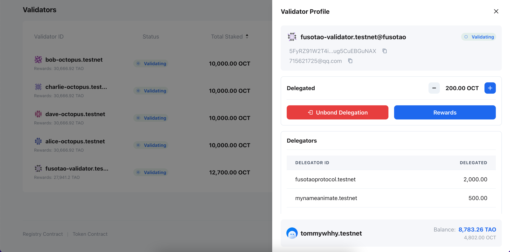

## Delegator operations

After delegating, you can do the below operations.

* Increase Delegation
* Decrease Delegation
* Claim Rewards
* Unbond Delegation (If there are un-claimed rewards, you need to claim rewards firstly)

### Increase/Decrease Delegation

First click on your validator to open the `Validator Profile` panel, then "increase" or "decrease" delegates by clicking the "+" or "-" in the image below.

### Claim Rewards

There are two cases for receiving rewards. One is to receive rewards by clicking `Rewards` in the above picture under normal circumstances.

In another case, after the validator is unbonded, if you have unclaimed rewards, you can claim them by clicking `Claim Rewards` in the `Validators` panel below.

### Unbond delegation and withdraw stake

You can stop delegating and retrieve your stake, and there is a delayed exit period, called the unbond period, for detail see [Octopus Network Staking](./../general/octopus-staking.html#octopus-network-staking). You will not be able to transfer your tokens before this period has elapsed, and you will not receive any staking rewards during this period (as you are not delegating any validators).

After the unbond period, you can withdraw your stakes via clicking the `Withdraw Stakes` button from `My Staking` panel as the same with the validator.

