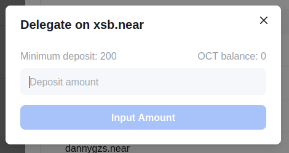

## Delegator operations

After delegating, you can do the below operations via clicking the `Action` button.

* Increase Delegation
* Decrease Delegation
* Claim Rewards
* Unbond Delegation (If there are un-claimed rewards, you need to claim rewards firstly)

**Note**: The following picture is the appchain Myriad as an example.

### Unbond delegation and withdraw stake

You can stop delegating and retrieve your stake, and there is a delayed exit period, called the unbonding period and it is 28 days. You will not be able to transfer your tokens before this period has elapsed, and you will not receive any staking rewards during this period (as you are not delegating any validators).

After the unbonding period, you can withdraw your stakes via clicking the `Withdraw Stakes` button from `My Staking` panel as the same with the validator.

