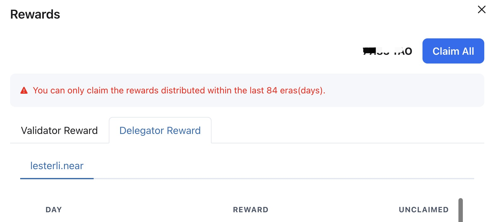
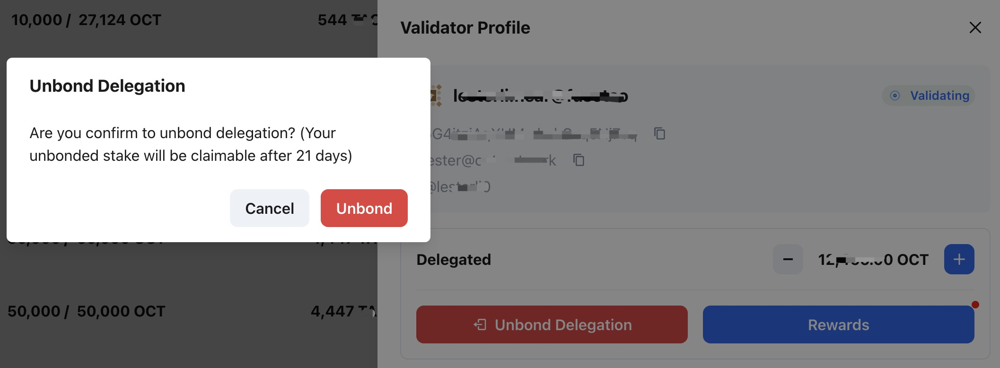
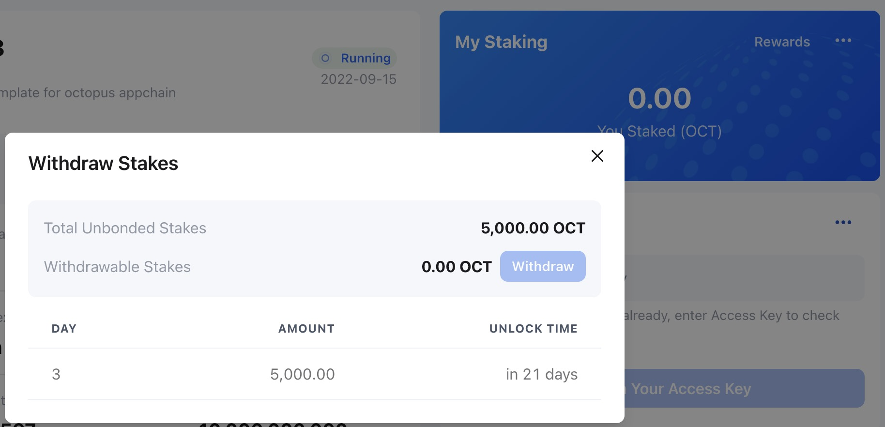

## Delegator operations

After the delegation, the delegator could select the delegated validator and click `Delegated` to open the `Validator Profile` page.

Delegator can do the below operations on the `Validator Profile` page.

* Increase/Decrease delegation
* Claim rewards
* Unbond delegation

### Increase/Decrease delegation

Click `+` or `-` to increase or decrease the delegation amount on the `Validator Profile` page.

### Claim rewards

After a reward cycle (~1 day), the delegator will obtain the staking rewards, which need to be claimed manually. Click the `Rewards` button on the `Validator Profile` page, then select `Delegator Reward` and click `Claim` to claim the rewards.

### Unbond delegation

Click the `Unbond Delegation` button on the `Validator Profile` page to perform the unbond delegation operation.

> **Note**: After unbond, the staking OCT will have an unbonding period. Before the unbonding period ends, it cannot be withdrawable and you will not obtain any staking rewards.

### Withdraw OCT

It is the same as the validator. Click `...` and select `Withdraw Stakes` on the **My Staking** area.

After the unbonding period ends, you can click the `Withdraw` button to withdraw the staked OCT.

