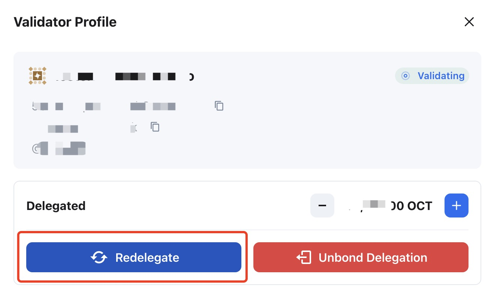

## Delegator operations

After the delegation, the delegator could select the delegated validator and click `Delegated` to open the `Validator Profile` page.

Delegator can do the below operations on the `Validator Profile` page.

* Increase/Decrease delegation
* Redelegate
* Unbond delegation

### Increase/Decrease delegation

Click `+` or `-` to increase or decrease the delegation amount on the `Validator Profile` page.

### Redelegate

The delegator can change to another validator on the same Appchain without the waiting period via the redelegate operation.

Click the `Redelegate` button on the `Validator Profile` page to perform the redelegate operation.

### Unbond delegation

Click the `Unbond Delegation` button on the `Validator Profile` page to perform the unbond delegation operation.

> **Note**: After unbond, the staking OCT will have an unbonding period. Before the unbonding period ends, it cannot be withdrawable and you will not obtain any staking rewards.

### Withdraw OCT

It is the same as the validator. Click `...` and select `Withdraw Stakes` on the **My Rewards** area.

After the unbonding period ends, you can click the `Withdraw` button to withdraw the staked OCT.

