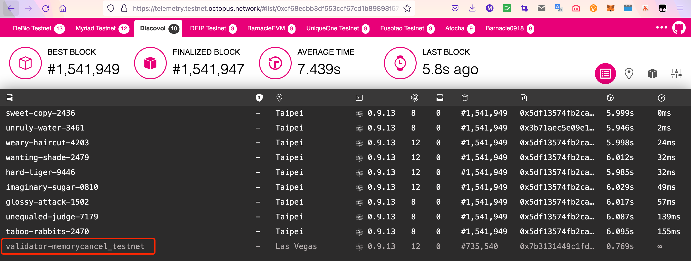
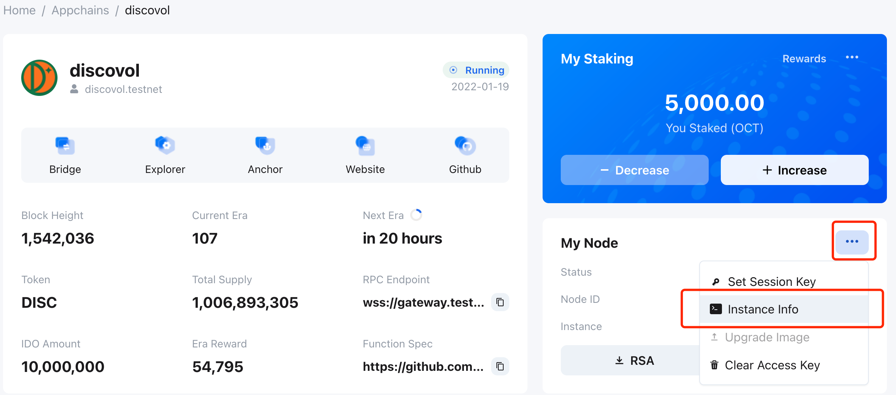

## Monitor Node

The telemetry will expose the node’s information, you can connect to specified telemetry servers with the `--telemetry-url` option. If you decided to send your node’s information to public telemetry, for the mainnet, when starting the validator node, you can set the `--telemetry-url` option with the value `'wss://telemetry.mainnet.octopus.network/submit 9'` and set the `--name` option with the node name. And then you can access the [telemetry](https://telemetry.mainnet.octopus.network/), and check the status of node via the node name.

> Note:
> * For the testnet, set the `--telemetry-url` option with the value `'wss://telemetry.mainnet.octopus.network/submit 9'` and access the [telemetry](https://telemetry.testnet.octopus.network/) to check the status of node.
> * If automatic deployment is used, the name of validator will be `validator-[near account]` defaultly, where the `[near account]` is the account name of the NEAR wallet, as shown below.

## Instance Information

If automatic deployment is used, you can click `...` in the `My Node` panel, and select `Instance Info` to view the running hardware status information (such as CPU, hard disk, and memory) of the current validator instance, as shown in the following figure:

