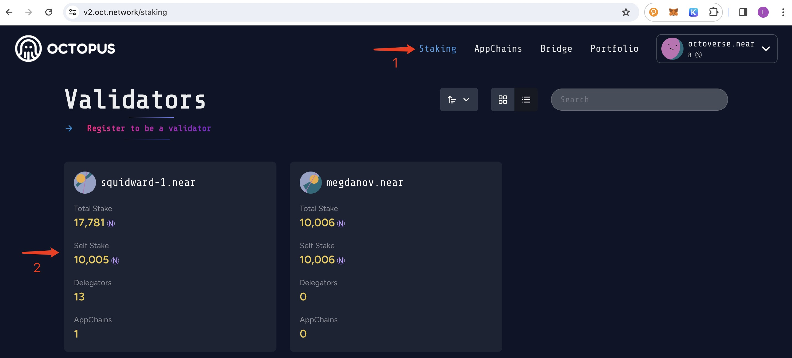

## How to Delegate

> **Note**
>
> The delegator does not need to run a validator node, but when looking for a validator to delegate, the delegator should check the stability of the validator node. If there is a problem with the validator, the delegator will not be able to obtain staking rewards.

The delegation steps are as follows:

1. Log in to Octopus Network [V2 Mainnet](https://v2.oct.network) with your NEAR account.

2. Navigate to open the tab **Staking** page, and then select the validator you want to delegate from the **Validators** list and click it to open the validator profile page.

3. Click the `Delegate Now` button on the validator profile page, input the amount of $NEAR you want to delegate on the pop-up page, and then click the `Confirm` button.

