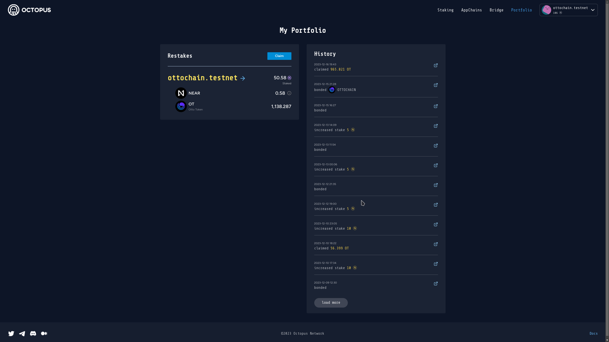

## Delegator Operations

The delegator operations includes:

* Claim rewards

Also, the delegator can do the below operations on the delegated validator's `Profile` page.

* Increase/Decrease delegation
* Undelegate

### Claim rewards

After a reward cycle (~1 day), the delegator will receive the restaking rewards, which needs to be claimed manually.

Navigate to click the tab **Portfolio** and open the **My Portfolio** page, and then click the `Claim` button to claim the rewards.

### Increase/Decrease delegation

Click `Manage` button and then select `Increase` or `Decrease` to increase or decrease the delegation amount.

### Undelegate

Click `Manage` button and then select `Undelegate` to perform the unbond delegation operation.

> **Note**: Both `Decrease` and `Undelegate` operations have the unbonding period. The NEAR cannot be withdrawable and no restaking rewards during the unbonding period.

