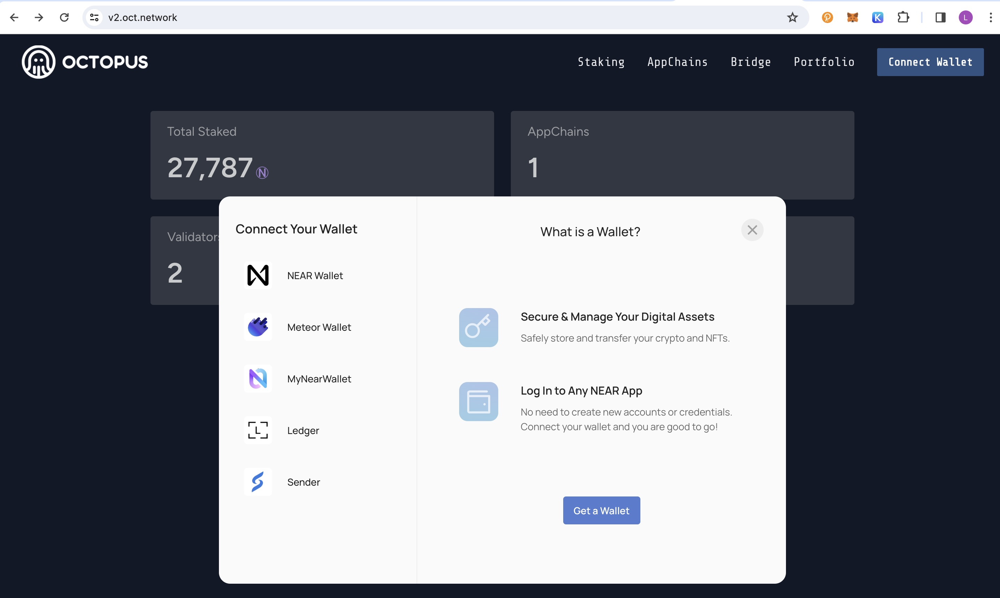

## Automatic deployment with Digital Ocean 

> If no Digital Ocean account, please firstly [create and setup Digital Ocean account](https://docs.digitalocean.com/products/getting-started/)
>
> To create [Digital Ocean Access Token](https://docs.digitalocean.com/reference/api/create-personal-access-token/)
>
> **Note**: 
> 
> Please remember the **Token Name**, and then timely copy and save the personal **Access Token**. If the Token expires, please create a new Access Token with the same Token Name. If using a new Digital Ocean account, please create the Access Token with a new Token Name.

Log in to the Octopus Network [V2 Mainnet](https://v2.oct.network/) with the NEAR account.

Click the `Appchains` and select the appchain which would like to be a validator, click it to open the appchain page, then perform the following operations:

1. In the **My Node** area of ​​the appchain page, select `Digital Ocean` and input your `Token Name` and `Token Key`, then click `Confirm`;

**Note**: The `Token Key` will only be used for this deployment and will not be stored anywhere.

2. In the **My Node** area, the `Deploying` means the automatic deployment service is deploying the node.

The deployment will take about 3~5 minutes, please wait patiently.

3. After the node synchronization, the validator can do the restaking by clicking `Bond Now` button.

