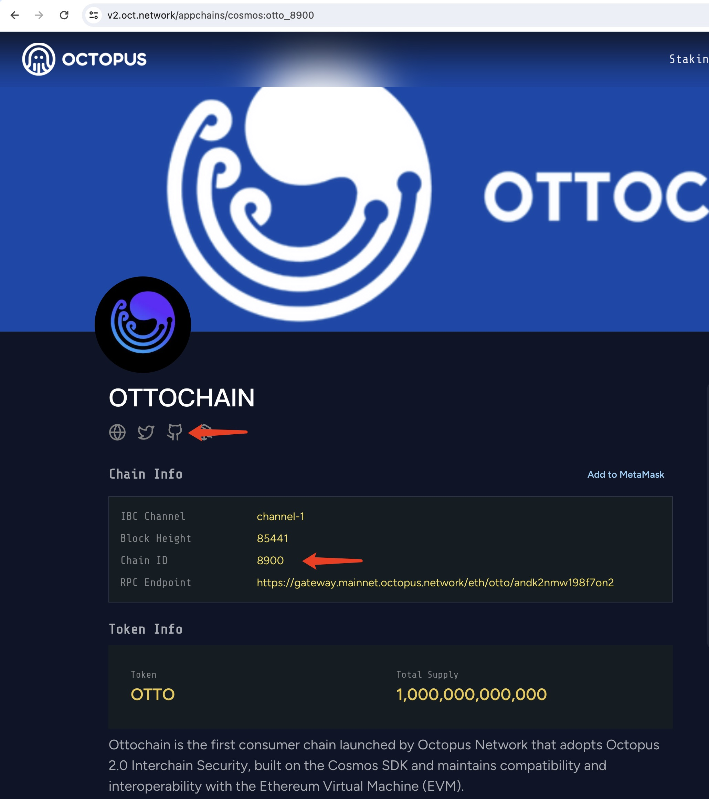
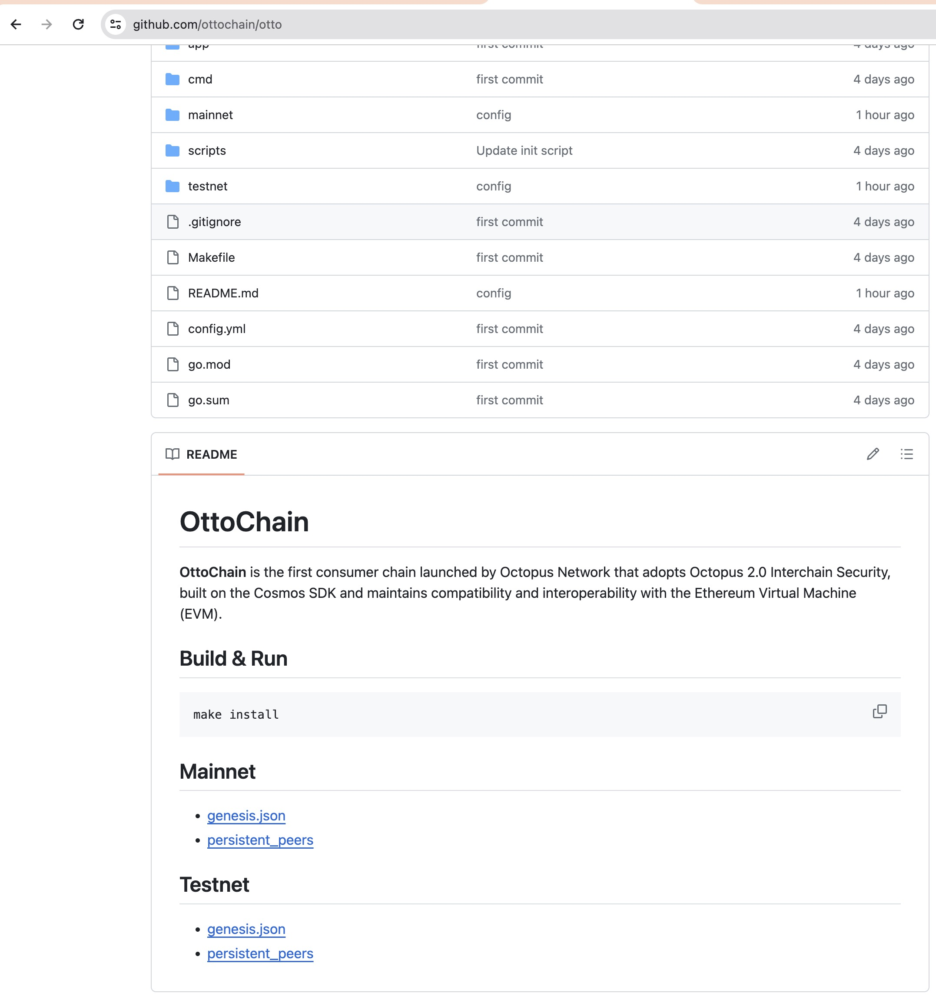

## Manually Deploy Appchain Node

> **Note**
>
> Before manually running an Appchain node, make sure you can handle node issues and exceptions. If there is a problem with the node, both the validator and its delegators will not be able to receive restaking rewards.

Learn how to run an Appchain node. To manually deploy the Appchain node, the validator can choose their favorite VPS provider, and generally using the **Ubuntu** operating system.

> **Note**
>
> Make sure your server has installed Go and necessary libraries which would be used to build Appchain node binary.
>
> * [Install Go](https://go.dev/doc/install) 
> * Install libraries: `sudo apt-get update && sudo apt-get upgrade -y && sudo apt-get install -y curl make git libc-dev bash gcc jq`


The following steps are required:

1. Build Appchain node binary
2. Initialize Node
3. Config Node
4. Run the Appchain Node

### Build Appchain node binary

Click the `Appchains` and select the appchain which would like to be a validator, click it to open the appchain page, you can get the GitHub repo and Chain ID of Appchain.



An example of building the Ottochain node binary is as follows:

```bash
git clone https://github.com/ottochain/otto.git
cd otto
make install

ottod -h
```

If you get the error `ottod: command not found`, please run the `go env` to check your `GOPATH`, and then run `cp $GOPATH/bin/ottod /usr/local/go/bin/ottod`. Now `ottod -h` should work fine.

### Initialize Node

Run the following command to initialize the node to create all the necessary validator and node configuration files:

```bash
<appchain_binary> init <your_custom_moniker> --chain-id <appchain_chain_id>
```

By default, the `init` command creates your `~/.<appchain_binary>` directory with subfolders `config/` and `data/`. In the config directory, the most important files for configuration are `app.toml` and `config.toml`.

```bash
~/.<appchain_binary>
├── config
│   ├── app.toml                    # Application-related configuration file.
│   ├── client.toml
│   ├── config.toml                 # Tendermint-related configuration file.
│   ├── genesis.json                # The genesis file.
│   ├── node_key.json               # Private key to use for node authentication in the p2p protocol.
│   └── priv_validator_key.json     # Private key to use as a validator in the consensus protocol.
└── data                            # Contains the databases used by the node.
    └── priv_validator_state.json
```

You can easily change the default directory by using the `--home` flag.

An example of using OttoChain `ottod` is as follows:

```bash
ottod init my-validator --chain-id otto_8900-1
```

#### Get the validator pubkey

Validator need to get the validator pubkey (**only for the validator who manually deploy Appchain node**), which used to set it to the Appchain node. You can get your validator pubkey on your validator node by running `show-validator` command.

An example of using OttoChain `ottod` is as follows:

```bash
ottod tendermint show-validator

{"@type":"/cosmos.crypto.ed25519.PubKey","key":"2CKdA3Sbl1hh6+Exdqy7LfspfGcgUtNhV1VwUAZcy7c="}
```

You need to save the value of key(e.g.`2CKdA3Sbl1hh6+Exdqy7LfspfGcgUtNhV1VwUAZcy7c=`) for the next step - [bond validator](./validator-operations.md).

### Config Node

You can get appchain configuration from the GitHub repo of Appchain and then config your node.

For example:



#### Copy the Genesis File

Download the `genesis.json` file from the appchain repo and copy it over to the config directory (e.g. `~/.<appchain_binary>/config`).

An example of using OttoChain `ottod` is as follows:

```bash
wget -O ~/.ottod/config/genesis.json https://raw.githubusercontent.com/ottochain/otto/main/mainnet/genesis.json
```

#### Add Persistent Peers

Your validator node needs to connect [peers](https://docs.tendermint.com/v0.34/tendermint-core/using-tendermint.html#peers) and maintain persistent connections with them. You'll need to set the `persistent_peers` field in `config.toml` under the config directory (e.g. `~/.<appchain_binary>/config`) with the list of available peers on the appchain repo.

Edit the file `config.toml` and add the persistent peers to the following:

```bash
#######################################################
###           P2P Configuration Options             ###
#######################################################
[p2p]

# ...

# Comma separated list of nodes to keep persistent connections to
persistent_peers = ""
```

You can also use `sed` to include them into the configuration. An example of using OttoChain `ottod` is as follows:

```bash
export persistent_peers="38b8a6277c277e63a7bcace0f8d3c0bce3d3fd1b@157.230.120.27:26656,c5373de49272255b85d1f1f55c42851de2d61a81@146.190.99.126:26656,146e4ff134270d8a641b0028445db42fee53e51a@34.71.98.174:26656,47f6ca01467e753208e170f053761fb99549de72@34.42.214.220:26656"
sed -i.bak "s/persistent_peers = \"\"/persistent_peers = \"${persistent_peers}\"/" ~/.ottod/config/config.toml
```

#### Set `minimum-gas-prices`

You can use `sed` to change the `minimum-gas-prices` in the file `app.toml`.

An example of using OttoChain `ottod` is as follows:

```bash
export IBC_TOKEN_DENOM=`jq -r '.app_state.crisis.constant_fee.denom' ~/.ottod/config/genesis.json`
sed -i.bak "s#minimum-gas-prices = \"0aotto\"#minimum-gas-prices = \"20000000000${IBC_TOKEN_DENOM}\"#" ~/.ottod/config/app.toml
```

### Run the Appchain Node

Run the following command to start the appchain node in background:

```bash
nohup <appchain_binary> start &
```

An example of using OttoChain `ottod` is as follows:

```bash
nohup ottod start &
```

And to check the log run the following command:

```bash
tail -f nohup.out
```

```bash
6:23AM INF Unlocking keyring module=server
6:23AM INF starting ABCI with Tendermint module=server
6:23AM INF starting node with ABCI Tendermint in-process module=server
6:23AM INF InitChain chainID=otto_8900-1 initialHeight=1 module=server
...
6:23AM INF This node is a validator addr=76CBD1E7565B06A74811C2F592689A6F487B7D38 module=consensus pubKey=2CKdA3Sbl1hh6+Exdqy7LfspfGcgUtNhV1VwUAZcy7c= server=node
6:23AM INF P2P Node ID ID=e25881e99f8a79028b7949bad1de4536802d74e0 file=/root/.ottod/config/node_key.json module=p2p server=node
6:23AM INF Add our address to book addr={"id":"e25881e99f8a79028b7949bad1de4536802d74e0","ip":"0.0.0.0","port":26656} book=/root/.ottod/config/addrbook.json module=p2p server=node
...
6:23AM INF service start impl=baseWAL module=consensus msg={} server=node wal=/root/.ottod/data/cs.wal/wal
6:23AM INF service start impl=Group module=consensus msg={} server=node wal=/root/.ottod/data/cs.wal/wal
...
6:23AM INF commit synced commit=436F6D6D697449447B5B323220353420313535203134322032343920313220313839203331203533203234382031333320383420313234203233382031373920323520302032313220323231203139352032313220373120313933203420323136203232352032302031393820353320313335203130322036325D3A327D module=server
6:23AM INF committed state app_hash=16369B8EF90CBD1F35F885547CEEB31900D4DDC3D447C104D8E114C63587663E height=2 module=state num_txs=0 server=node
6:23AM INF indexed block exents height=2 module=txindex server=node
```

After the node synchronization, the validator needs to [bond validator](./validator-operations.md).
