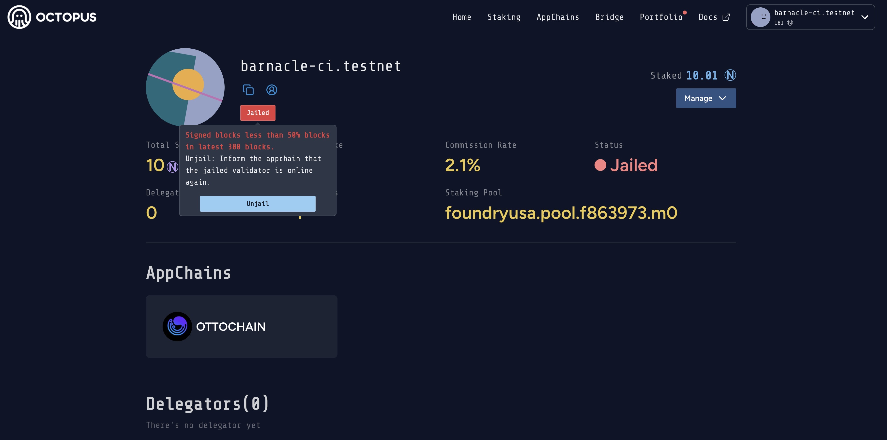

## Validator Operations

The validator operations includes:

* Bond
* Claim rewards
* Unjail
* Unbond restaking
* Unstake $NEAR

### Bond

Restaking your staked $NEAR to bond an appchain via the following steps:

1. Navigate to click the tab **Staking** to open the **Validators** page, and then click the link **Manage my validator**.

2. Click the **Manage** and select the **Bond** operation.

3. Select the appchian which you want to bond, input your validator pubkey which is used to create a new validator by restaking $NEAR.

### Claim rewards

After a reward cycle (~1 day), the validator will receive the restaking rewards, which needs to be claimed manually.

Navigate to click the tab **Portfolio** and open the **My Portfolio** page, and then click the `Claim` button to claim the rewards.

### Unjail

When the validator status is jailed, the validator first should check the validator node, make it run normally, and then execute the unjail operation to inform the Appchain that your validator node is online again.

Navigate to click the tab **Staking** and open the **Validators** page, and then click **Manage my validator** and open the Valiator Profile page, click the `Jailed` and click `unjail` button to execute unjail operation.

If you are not sure what is wrong with your node, you can ask help from the **validator-assistance** channel under the **VALIDATORS & DELEGATORS** category on [Discord](https://discord.gg/6GTJBkZA9Q).

### Unbond restaking

If you would like to unbond your staked $NEAR from an appchain via the following steps:

1. Navigate to click the tab **Staking** to open the **Validators** page, and then click the link **Manage my validator**.

2. Click the **Manage** and select the **Unbond** operation.

>
> **Note**: 
> 
> After **Unbond** restaking, you are still the NEAR validator, and your $NEAR are still **staked** in a NEAR staking pool. So, please note that these $NEAR cannot be withdrawn.

### Unstake $NEAR

If you would like to withdraw your staked $NEAR via the following steps:

1. Navigate to click the tab **Staking** to open the **Validators** page, and then click the link **Manage my validator**.

2. Click the **Manage** and select the **Unstake** operation.

>
> **Note**: 
> 
> For **Unstaking**:
>
> In case you have not done the Unbond operation, your staked $NEAR will be returned to you after the unbonding period of 7 days.
>
> However, if you have already executed the Unbond operation, you can expect to receive your staked $NEAR within 2~4 days.
