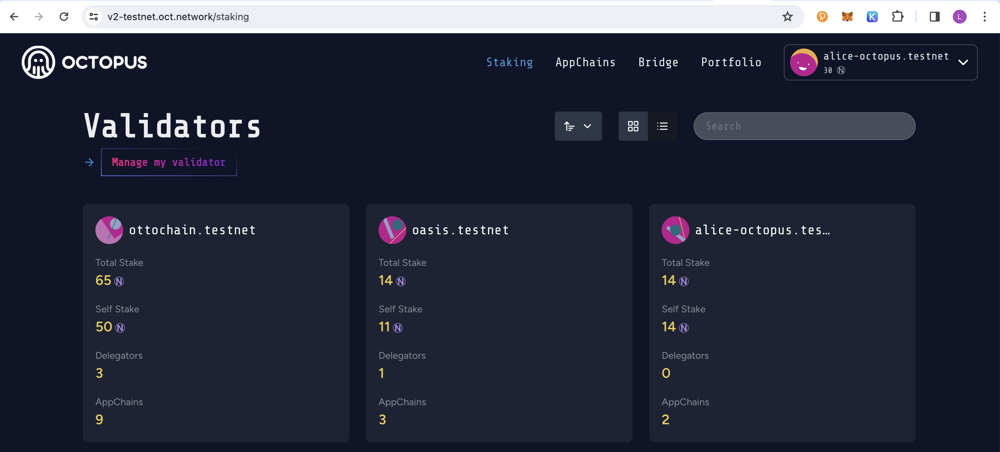
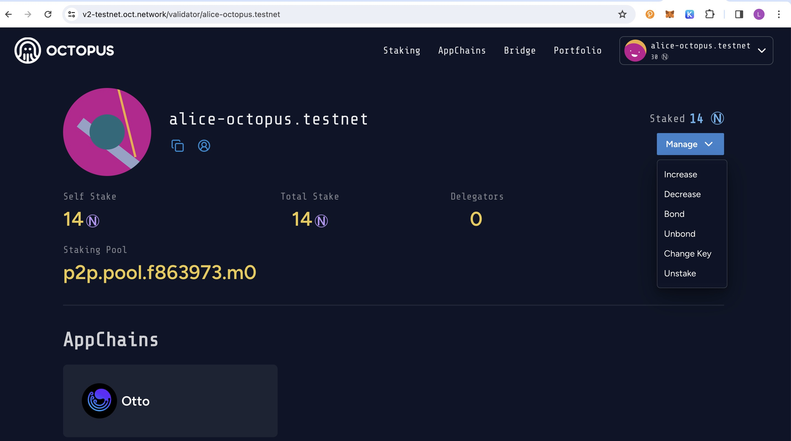
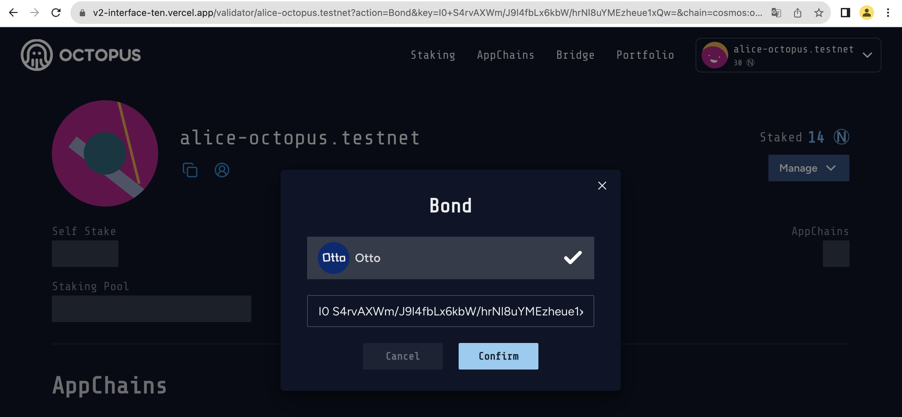
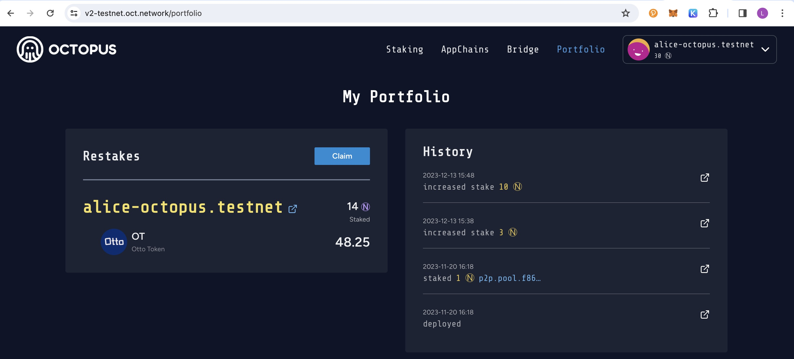

## Validator Operations

The validator operations includes:

* Bond
* Claim rewards
* Unbond
* Unstake $NEAR

### Bond

Restaking your staked $NEAR to bond an appchain via the following steps:

1. Navigate to click the tab **Staking** to open the **Validators** page, and then click the link **Manage my validator**.



2. Click the **Manage** and select the **Bond** operation.



3. Select the appchian which you want to bond, input your validator pubkey which is used to create a new validator by restaking $NEAR.




#### Get the validator pubkey

You can find your validator pubkey on your validator node by running `show-validator` command.

An example of using OttoChain `ottod` is as follows:

```bash
ottod tendermint show-validator

{"@type":"/cosmos.crypto.ed25519.PubKey","key":"2CKdA3Sbl1hh6+Exdqy7LfspfGcgUtNhV1VwUAZcy7c="}
```

### Claim rewards

After a reward cycle (~2 hours), the validator will receive the restaking rewards, which needs to be claimed manually.

Navigate to click the tab **Portfolio** and open the **My Portfolio** page, and then click the `Claim` button to claim the rewards.


