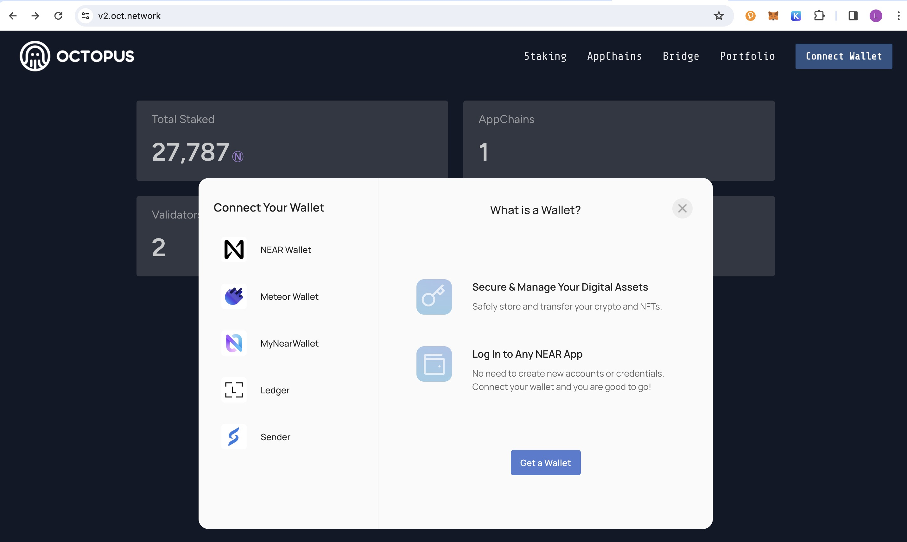
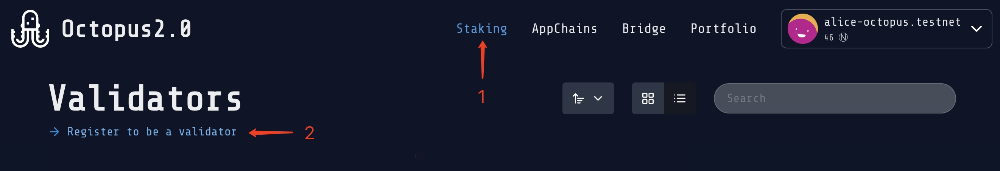
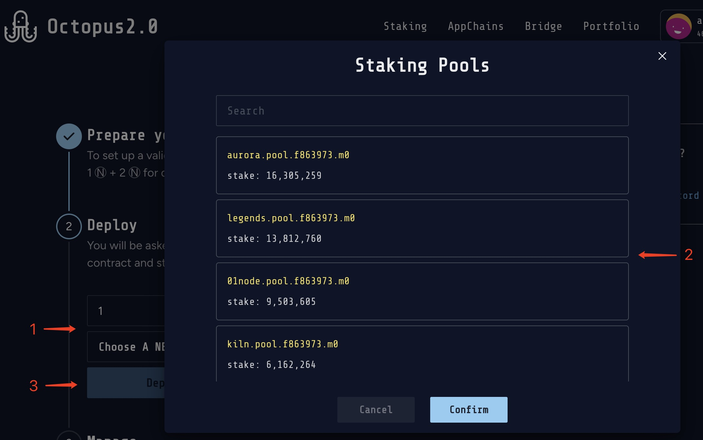
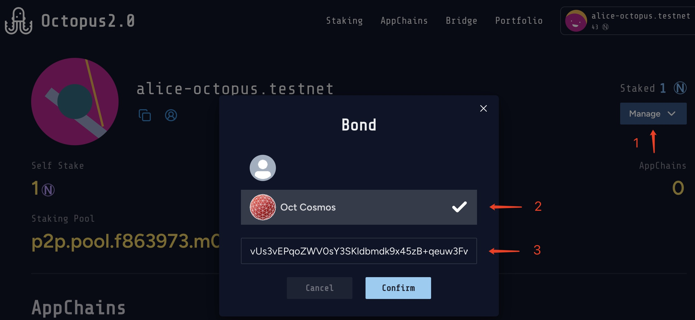
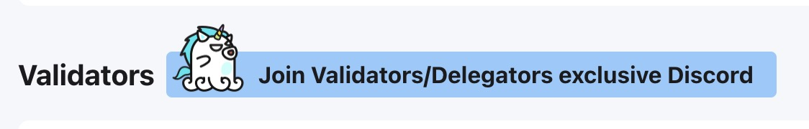

## Register Validator

> **Note**
>
> The following instructions assume you have already [set up an appchain node](./validator-deploy-manually.md) and are synchonised to the latest blockheight.

Learn how to register validator of the appchain via the following steps:

* Connect wallet
* Staking $NEAR
* Restaking $NEAR and bond

1. Log in to Octopus Network [V2 Mainnet](https://v2-interface-ten.vercel.app/) with the NEAR account created in [Generate Validator Account](./validator-generate-keys.md).



2. Navigate to open the tab **Staking** page and click the link **Register to be a validator**.



And then complete the following steps to deploy and stake $NEAR:

* Input the amount of $NEAR
* Select a staking pool to stake $NEAR



3. Restaking your staked $NEAR to bond an appchain via the following steps:

* Click the **Manage** and select the **Bond** operation
* Select the appchian which you want to bond
* Input your validator pubkey which is used to create a new validator by restaking $NEAR



#### Get the validator pubkey

You can find your validator pubkey on your validator node by running `show-validator` command.

An example of using OttoChain `ottod` is as follows:

```bash
ottod tendermint show-validator

{"@type":"/cosmos.crypto.ed25519.PubKey","key":"2CKdA3Sbl1hh6+Exdqy7LfspfGcgUtNhV1VwUAZcy7c="}
```

---

**Congratulations!** If you have followed all of these steps, and been selected to be a part of the validator set, you are now running a appchain validator! Welcome to join the validator/delegator Discord channel via clicking the button on each Appchain page.

