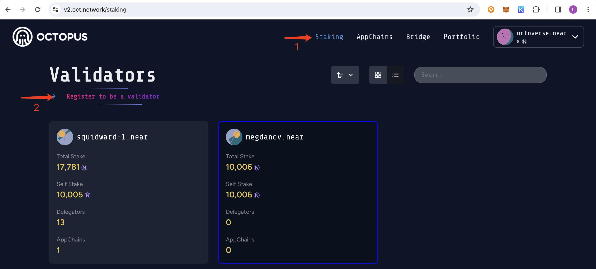
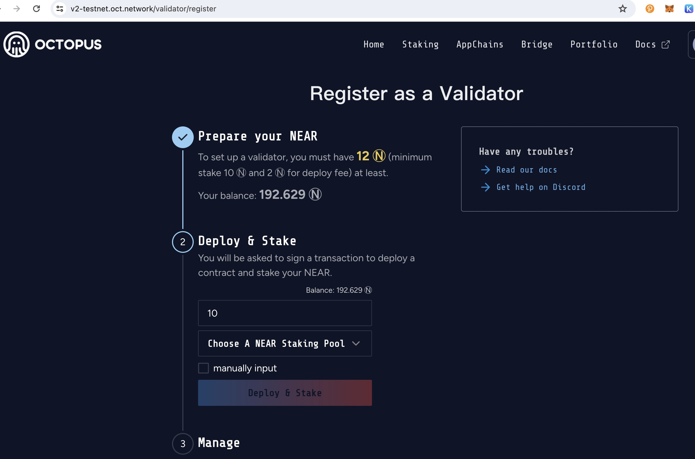

## Register Validator

> **Prerequisites**
>
> Every validator must have a NEAR account, which used to log in to the Octopus network and register the validator.
>
> To create a NEAR account, please refer to [Creating a NEAR Account](https://docs.near.org/concepts/basics/accounts/creating-accounts)

Learn how to register validator of the appchain via the following steps:

* Connect wallet
* Staking $NEAR

1. Log in to Octopus Network [V2 Mainnet](https://v2.oct.network/) with the NEAR account.

2. Navigate to open the tab **Staking** page and click the link **Register to be a validator**.

And then complete the following steps to deploy and stake $NEAR:

* Input the amount of $NEAR
* Select a NEAR staking pool to stake $NEAR

To make the $NEAR staking more decentralized, the staking pools that have been selected by the current validators will not appear in the NEAR Staking Pool list.

Also, if you are the owner of the staking pool or desire to stake a dedicated staking pool, you can stake the staking pool by clicking the **manual input** and then input its name.

