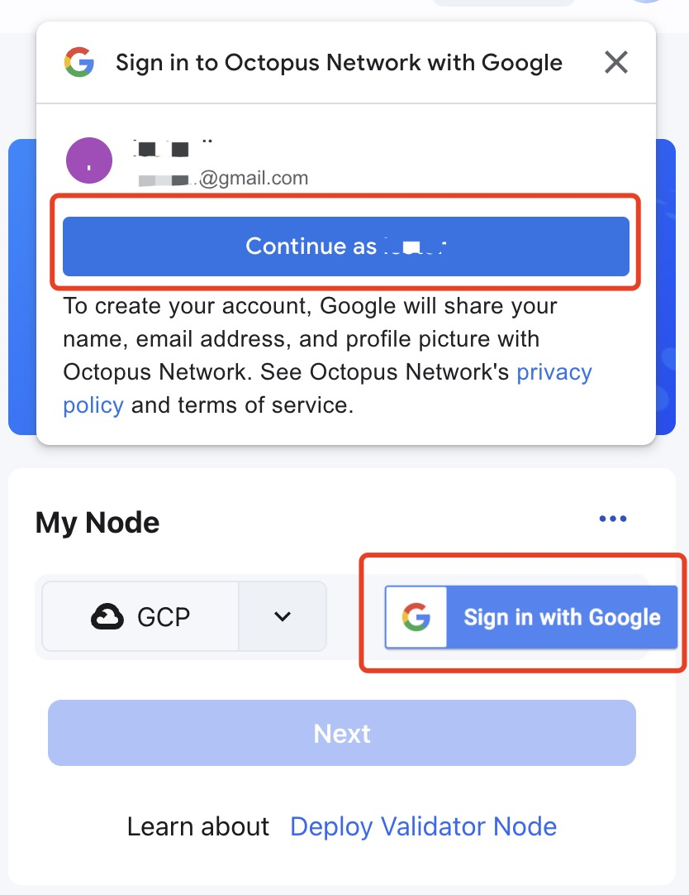
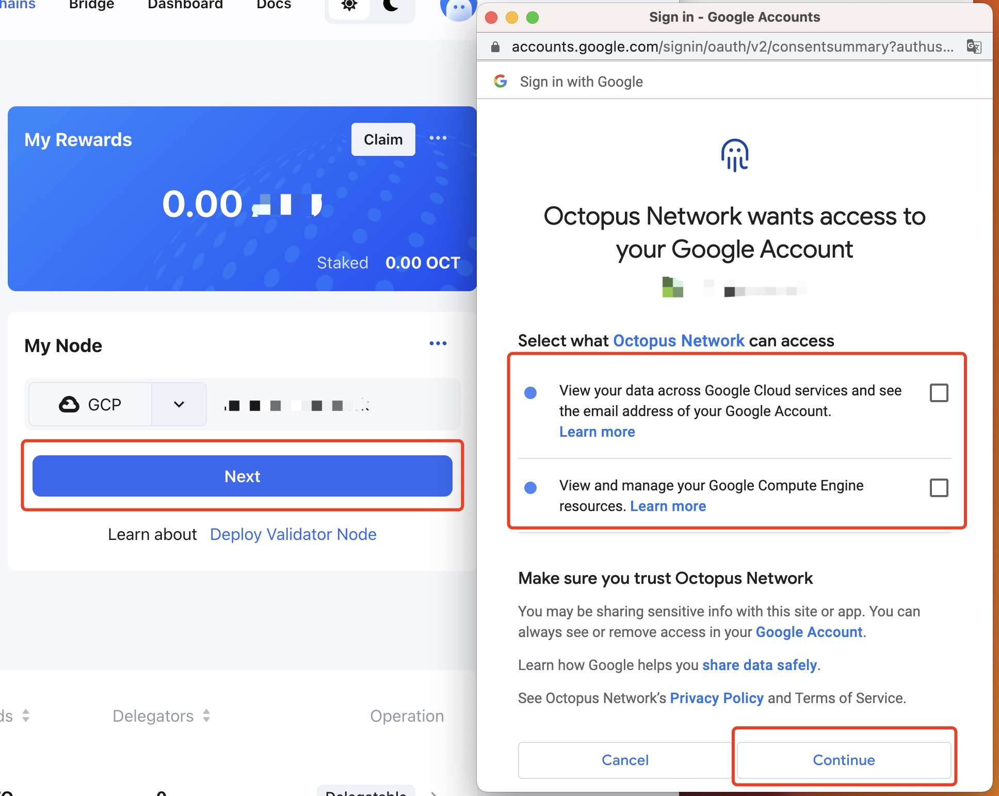
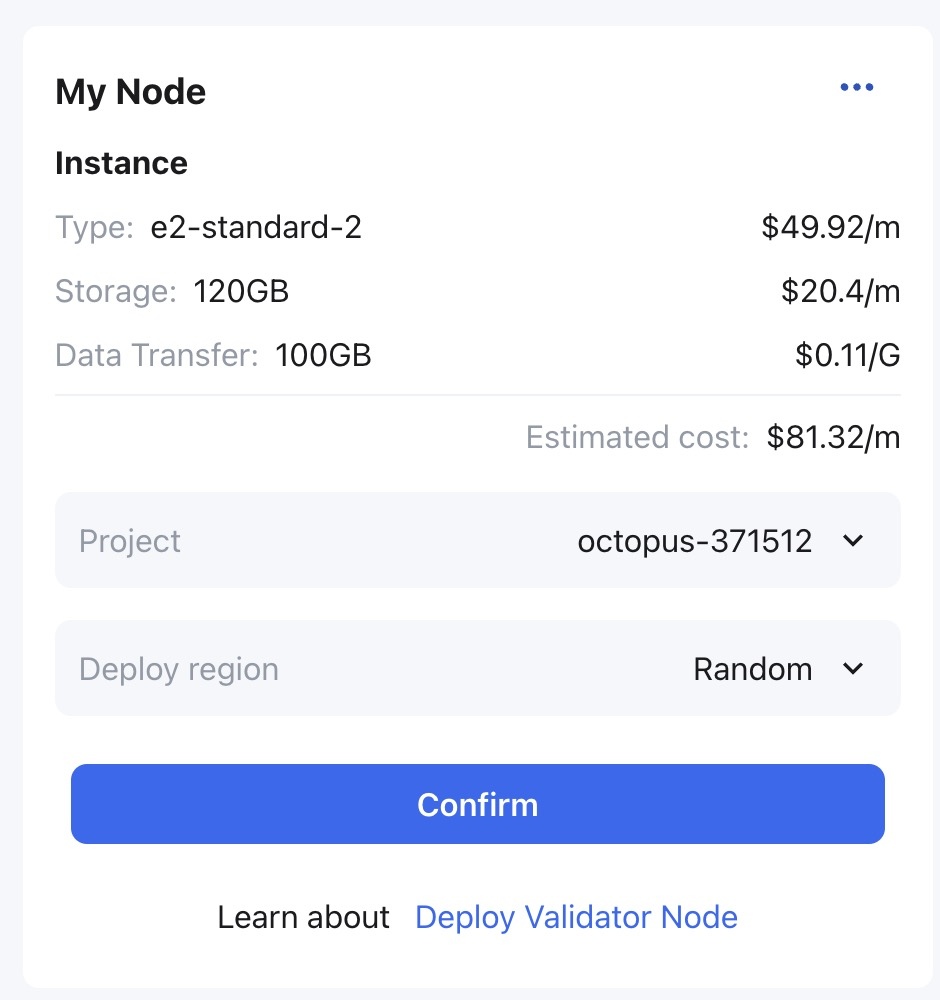
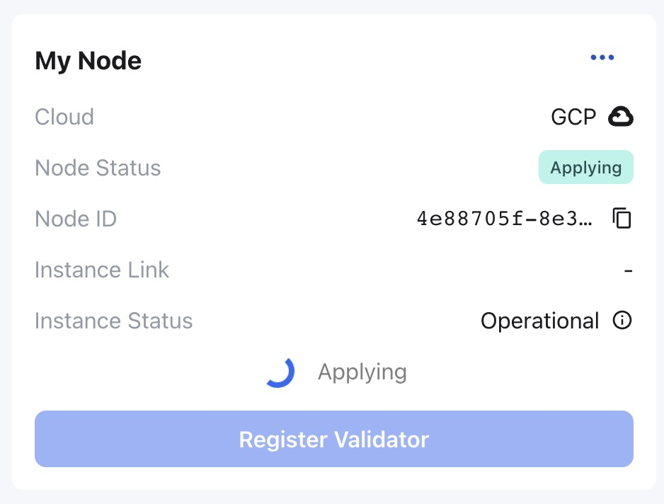
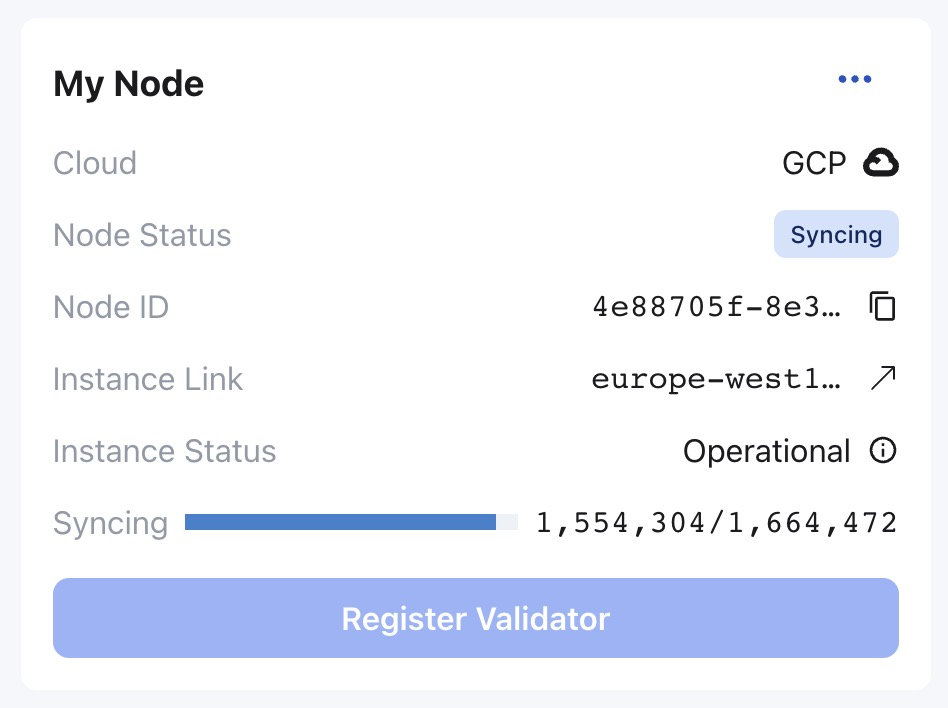
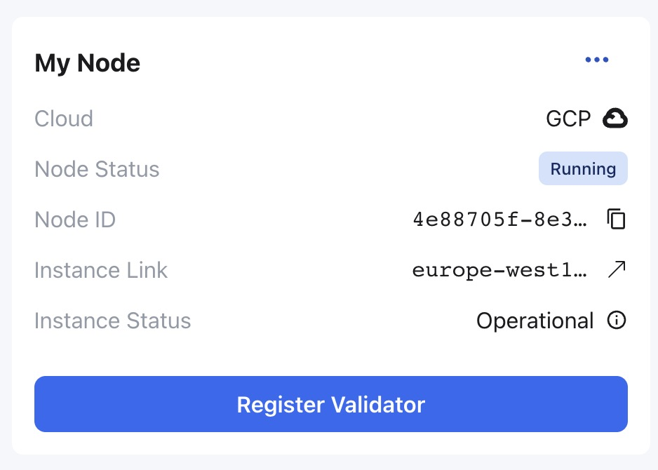
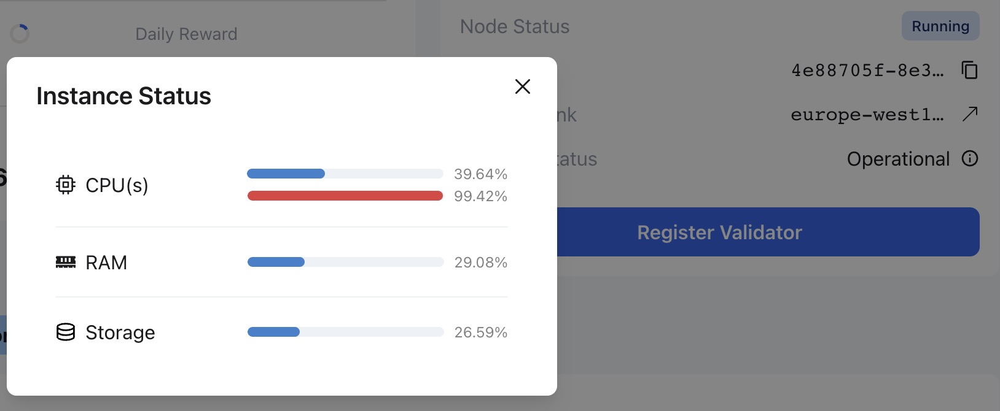

## Automatic deployment with GCP

### Before you begin

1. [Create a Google Account](https://support.google.com/accounts/answer/27441?hl=en)
2. [Create a Google Cloud project](https://cloud.google.com/resource-manager/docs/creating-managing-projects).
3. [Create a Billing account](https://cloud.google.com/billing/docs/how-to/manage-billing-account) and [enable billing for the Cloud project](https://cloud.google.com/billing/docs/how-to/modify-project).
4. [Enable the Compute Engine API](https://console.cloud.google.com/apis/api/compute.googleapis.com/overview).

### Deploy

Log in to the Octopus Network [mainnet](https://mainnet.oct.network) with the NEAR account created in [Generate Validator Account](./validator-generate-keys.md).

Click the `Appchains` and select the appchain which would like to be a validator, click it to open the appchain page, then perform the following operations:

1. In the **My Node** area of ​​the appchain page, select `GCP` and login with your `Google Account`, 

After login, click `Next` and select the Octopus Network can access and click `Continue`;

2. The deployed GCP instance configuration information and approximate cost will be displayed in the **My Node** region. After confirmation, select the project and select the deployment area of the instance in the `Deploy region` drop-down box, then click `Confirm`;

3. In the **My Node** area, the node status is `Applying` which means the automatic deployment service is deploying the node.

Please wait for about 3~5 minutes, the node status will change to `Syncing` which means the validator node is synchronizing the block data of the appchain. The earlier the appchain is online, the longer the node synchronization time will be. please wait patiently.

To check the synchronization of nodes, please refer to [Monitor Node](./monitor-node.md).

After the node synchronization, the status in the **My Node** area will change to `Running`.

For the automatically deployed validator node, in the **My Node** area, the validator can click the icon on the right of the `Instance Status` field to check the instance status information (such as CPU, hard disk, memory) of the running validator node instance.

At the `Running` status, the validator can proceed to the next step [register validator](./validator-register.md).