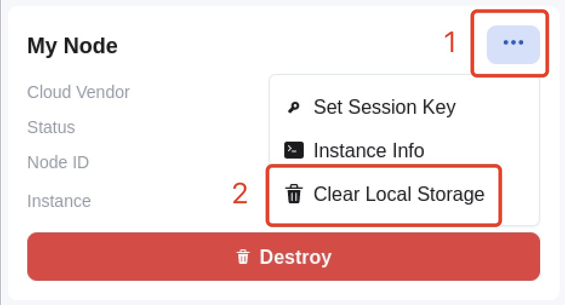

## Deploy Validator Node

In order to simplify the deployment of the validator node, the Octopus Network team provides an automatic deployment service for the validator node. Currently, it supports:

* [AWS](./validator-deploy-aws.md)
* [Digital Ocean](./validator-deploy-do.md)

Also, the validator can choose to [manually deploy the validator node](./validator-deploy-manually.md).

### Hardware configuration

The configuration and approximate cost of each Appchain validator node which is deployed via the automatic deployment service.

**AWS**

| Appchain | EC2 Instance Type  | Storage | Data Transfer | Estimated monthly cost |
|------|------|------|------|------|
| debionetwork | t3.small 2 GB Memory / 2 vCPUs | 120 GB | 100 GB | $45 |
| myriad | t3.small 2 GB Memory / 2 vCPUs | 120 GB | 100 GB | $45 |
| deip | t3.small 2 GB Memory / 2 vCPUs | 120 GB | 100 GB | $45 |
| atocha | t3.small 2 GB Memory / 2 vCPUs | 120 GB | 100 GB | $45 |
| fusotao | c5.large 4 GB Memory / 2 vCPUs | 250 GB | 4500 GB | $509 |
| discovol | t3.small 2 GB Memory / 2 vCPUs | 120 GB | 100 GB | $45 |

**Digital Ocean**

| Appchain | Droplet  | Storage | Data Transfer | Estimated monthly cost |
|------|------|------|------|------|
| debionetwork | 2 GB Memory / 2 vCPUs | 120 GB | 3 TB | $33 |
| myriad | 2 GB Memory / 2 vCPUs | 120 GB | 3 TB | $33 |
| deip | 2 GB Memory / 2 vCPUs | 120 GB | 3 TB | $33 |
| atocha | 2 GB Memory / 2 vCPUs | 120 GB | 3 TB | $33 |
| fusotao | 8 GB Memory / 4 vCPUs  | 250 GB | 5 TB | $81 |
| discovol | 2 GB Memory / 2 vCPUs | 120 GB | 3 TB | $33 |

### Change VPS provider

For the validator who need to change the VPS provider of the deployed node, please follow these steps:

1. Keep the old validator node running;
2. Deploy a new validator node. For the node which was deployed via the automatic deployment service, please `Clear Local Storage` if needed.

3. When the new node done the synchronization, please [set the Session Key](./validator-register.md#set-session-key) for the new validator node;
4. The validator could [stop](./validator-register.md#stop-the-validator-node) the old validator node until the next reward cycle.