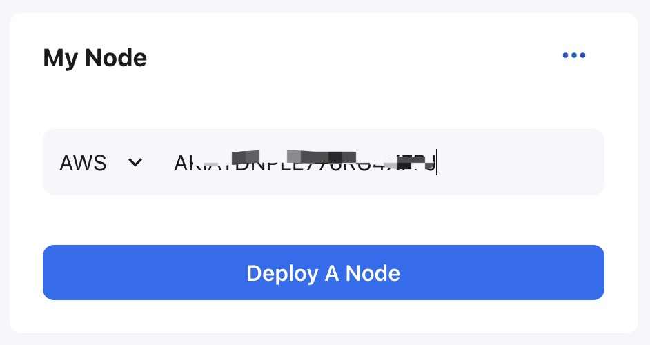
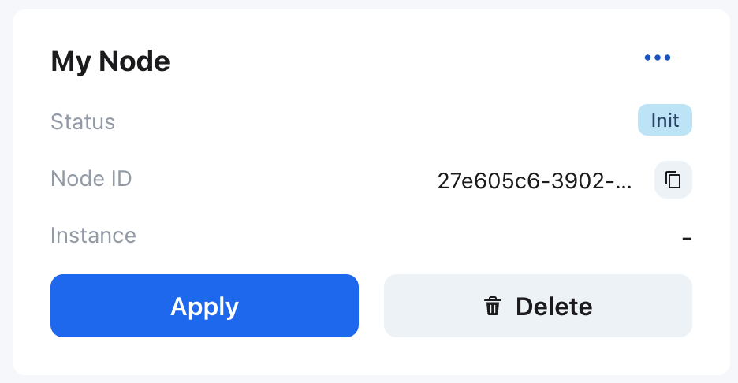
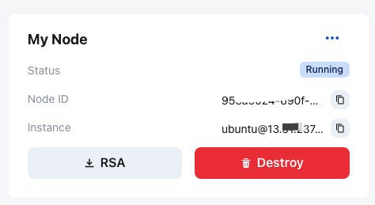
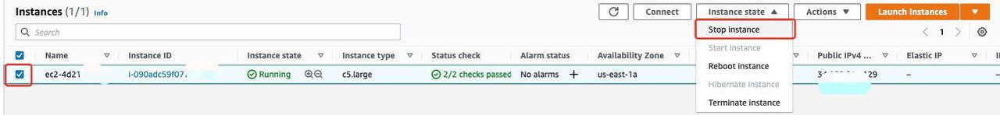
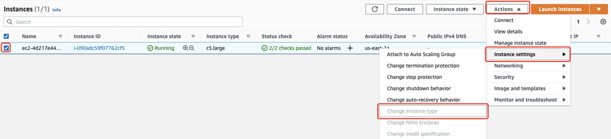
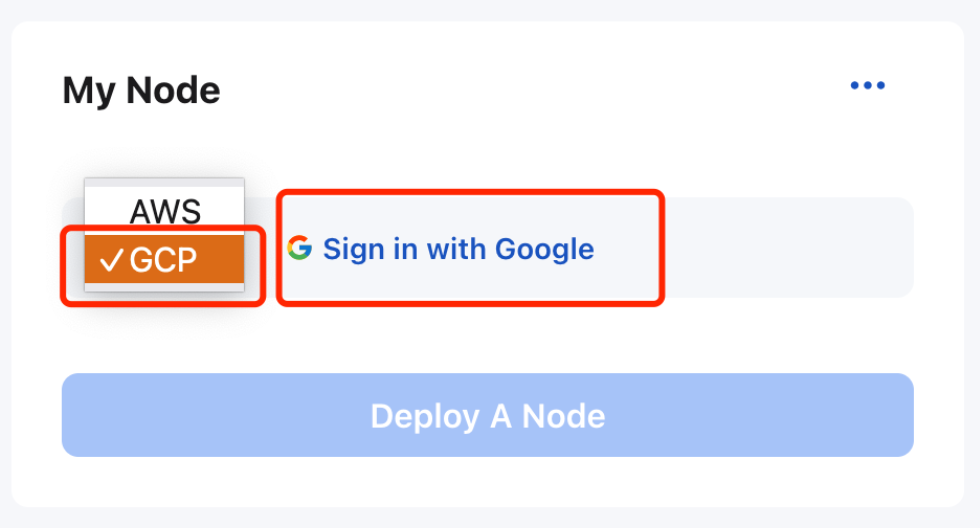
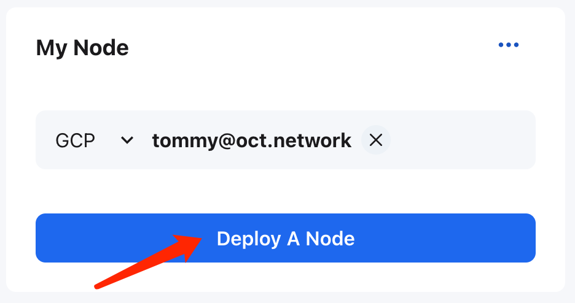
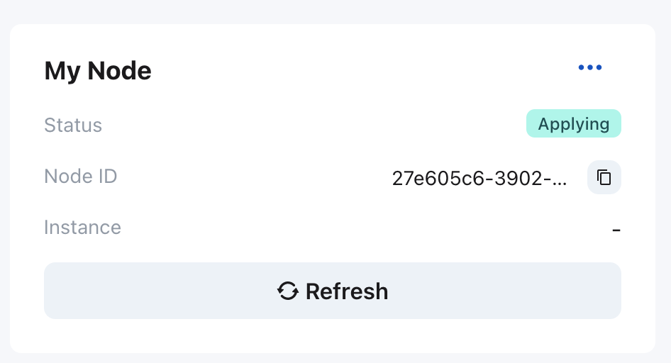
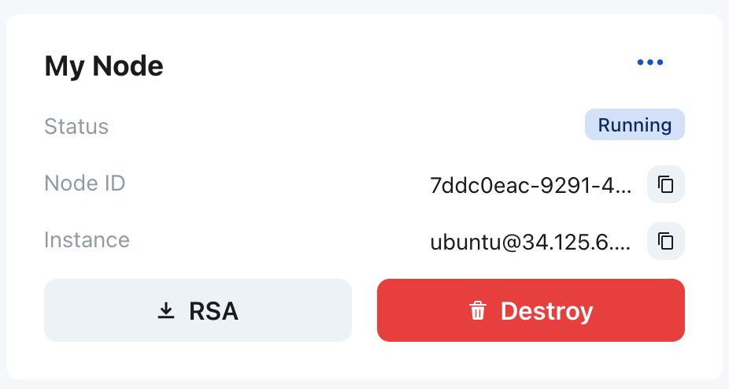

## Deploy Validator Node

Octopus Network provides a auto-deploy service of validator nodes. Optionally, validator node operators can also [deploy and run it manually](./validator-deploy-manually.md).

### Hardware configuration

Auto-deploy service supports AWS, and will support other cloud services such as GCP in the future. If you manually set up your validator node, you could refer to following configuration:

> If using AWS, the default configuration is EC2 instance **t3.small**, CPU 2 cores, memory 2G, SSD storage 80G.
>
> If using GCP, the default configuration is instance **e2-small**, CPU 2 cores, memory 2G, SSD storage 128G.


### Using AWS Automatically Deploy

> If no AWS account, please firstly [create and setup AWS account](https://aws.amazon.com/getting-started/guides/setup-environment/?nc1=h_ls)
>
> To create [AWS Access Key](https://docs.aws.amazon.com/IAM/latest/UserGuide/id_credentials_access-keys.html)

Go to the Octopus Apps ([Mainnet](https://mainnet.oct.network) and [Testnet](https://testnet.oct.network)), select `Appchains` Tab ->  the corresponding appchain, follow the steps to deploy:

1. Go to **My Node** panel, enter your `AWS Access Key`, click `Deploy A Node`, and select the region where the instance would be deployed, click `Deploy`;




2. After deployment initialization, click `Deploy`, enter your `AWS Access Secret` and confirm.



**Note**: `AWS Access Secret` will only be used for this deployment and wouldn't be stored anywhere.

3. The deployment process lasts about 5 minutes, and then refresh the page to check the status, the successful deployment is as shown in the figure below. Record the login information of the instance and click the `RSA` to download the ssh key file.



### Change the AWS Instance Type

As appchain needs change, you can resize your AWS instance by changing its instance type. You need to find the auto deployed EC2 instance in AWS console. 

First, stop instance. 



And then, change instance.



For detail information, you can refer to the AWS EC2 [Change instance type](https://docs.aws.amazon.com/AWSEC2/latest/UserGuide/ec2-instance-resize.html).


### Using GCP Automatically Deploy

> Please make sure that you can log in to [GCP](https://console.cloud.google.com/), if not, please register first.

1. Log in to your Google account in `My Node` pannel.


2. After logging in, click `Deploy A Node`


3. Select [`Projects`](https://cloud.google.com/storage/docs/projects) and [`Deploy Region`](https://cloud.google.com/docs/geography-and-regions ), then click `Deploy`.


4. At this point, you can see that the node status is `Init`, and the `Node ID` is generated at the same time, click `Apply`.


5. At this point, the status changes to Applying, which means the node is starting up on GCP. Click Refresh to query the status.


6. When you see the following page, the status changes to Running, indicating that the GCP instance has been started and running.


Finally, if you want to delete the node, click `Destroy`, then click `...` to select `Clear Access Key`.

### Check the synchronization of the validator node

For the validator node, it would last about 1~6 hours (it depends on how long the appchain had been running) to complete the synchronization of the appchain data.

1. Firstly, please change the permissions of the downloaded ssh key file 'id_rsa' via executing the following command:

```bash
chmod 400 <Path of the id_rsa file>
# e.g. chmod 400 /home/ubuntu/.ssh/id_rsa
```

2. Open a Terminal, and log in to the instance via SSH;

```bash
ssh -i <Path of the id_rsa file> ubuntu@<IP address of instance>
# e.g. ssh -i /home/ubuntu/.ssh/id_rsa ubuntu@1.2.3.4
```

3. Check the docker logs of validator;

```bash
docker logs seashell
```

To check whether the best block number is the same with the current block number, like the following output:

```bash
2021-09-21 00:12:09 ✨ Imported #54411 (0x3566…3b0e)
2021-09-21 00:12:12 ✨ Imported #54412 (0xdf36…2c87)
2021-09-21 00:12:12 [54412] 🐙 Current block: 54412 (parent hash: 0x9cc7f31a20793f50cf885835de0e3977a1e080431ebc002469aa176046ba094a)
......
2021-09-21 00:13:18 ✨ Imported #54434 (0xba36…ee68)
2021-09-21 00:13:18 [54434] 🐙 Current block: 54434 (parent hash: 0x84aa3d1b6455859f9503d6ecc70b50b183141fe08f5b0695357e00fe1d24d915)
2021-09-21 00:13:18 💤 Idle (6 peers), best: #54434 (0xba36…ee68), finalized #54431 (0xd194…b319), ⬇ 22.0kiB/s ⬆ 21.9kiB/s
```