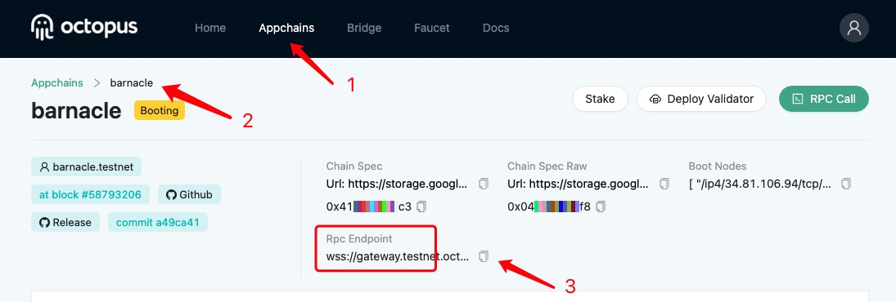
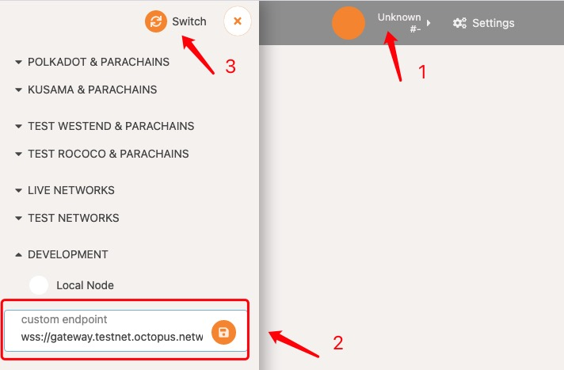

## Generate Validator Account

Each validator should have an Appchain account. There are 3 options to generate the account. Regardless of which option you choose, be sure to record all of the outputs as you will need them later.

Appchain is developed based on the Substrate, so the ways to generate an Appchain account is the same as other Sustrate-based chains (e.g. Polkadot).

### Option 1: Polkadot{.js} Browser Plugin

This option is **RECOMMENDED FOR MOST USERS**.

The Polkadot{.js} Browser Plugin is a simple tool for managing accounts in a browser extension which can sign extrinsics.

Generate your Appchain account with the [Polkadot{.js} Browser Plugin](https://wiki.polkadot.network/docs/en/learn-account-generation#polkadotjs-browser-plugin).

### Option 2: Subkey

This option is **ADVANCED and MOST SECURE**.

Subkey is a command-line utility included with Substrate that generates or restores Substrate keys. It is recommended for technically advanced users who are comfortable with the command line and compiling Rust code, and it is not recommended for general users.

For detailed build and usage instructions of subkey, please refer to the [subkey readme](https://github.com/paritytech/substrate/tree/master/bin/utils/subkey).

### Option 3: PolkadotJS-Apps

To create an Appchain account by following a few steps:

#### 1. Get the RPC Endpoint of the Appchain. 

For the Octopus [test network](https://testnet.oct.network/), you can get the RPC Endpoint from the Appchain page.

#### 2. Set the Polkadot Apps

Go to the [Polkadot Apps](https://polkadot.js.org/apps/#/explorer), you should set the custom rpc with the RPC Endpoint, click the Switch, and then you could connect to the Appchain network.

#### 3. Create the Appchain account

After connecting to the network, you can and create new account.

