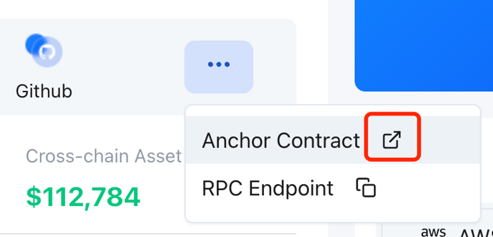
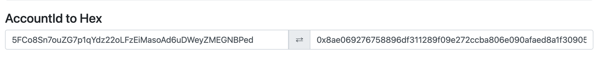
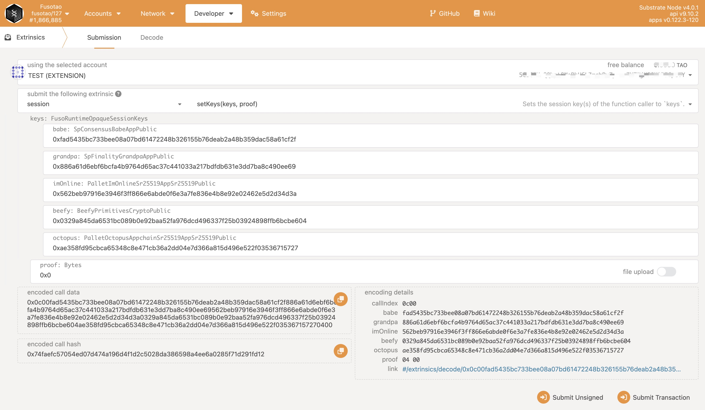

## Register Validator

This guide is for the manually deployed validator. 

To register the validator of the appchain, the validator need to complete the operations of registering the validator and setting the Session Key.

### Register validator

To register validator with the NEAR CLI via the following steps:

1. Install NEAR CLI.

> Note: Make sure you have a current version of `npm` and `NodeJS` installed.

```bash
npm install -g near-cli
```

For more details, please refer to the NEAR CLI [installation](https://github.com/near/near-cli#installation).

2. Log in with your NEAR account
    
> Note: The default network for `near-cli` is **testnet**.

```bash
# change the network to mainnet
export NEAR_ENV=mainnet
near login
```

Once complete, you will now have your Access Key stored locally in a hidden directory called `.near-credentials`. For more details, please refer to the NEAR [login](https://github.com/near/near-cli#near-login)

3. Execute the command to register validator, the parameters are described as follows:

* `ANCHOR_ACCOUNT_ID` and `receiver_id`, the validator can get the anchor contract account on each Appchain page

* `amount`, the amount of staking OCT by the validator and its decimal is 18;
* `validator_id_in_appchain`, the hex format of the validator appchain account which is generated in the step [Generate Validator Account](./validator-generate-keys.md), and you can use [this online tool](https://www.shawntabrizi.com/substrate-js-utilities/) and select `AccountId to Hex` to convert the appchain account to its hex format.

* `can_be_delegated_to`, select whether the validator node accepts [delegator delegation](./delegator-delegate.md);
* `socialMediaHandle`, the social media account of the validator, e.g. Twitter account;
* `email`, the contact email of the validator;

Take Fusotao as an example.

```bash
export NEAR_ENV=mainnet
export OCT_TOKEN_ACCOUNT_ID=f5cfbc74057c610c8ef151a439252680ac68c6dc.factory.bridge.near
export ANCHOR_ACCOUNT_ID=fusotao.octopus-registry.near
export NEAR_ACCOUNT=<Validator NEAR account>
# example command
near call $OCT_TOKEN_ACCOUNT_ID ft_transfer_call '{"receiver_id": "'$ANCHOR_ACCOUNT_ID'", "amount": "50000000000000000000000", "msg": "{\"RegisterValidator\":{\"validator_id_in_appchain\":\"0x8ae069276758896df311289f09e272ccba806e090afaed8a1f30905833e9903f\",\"can_be_delegated_to\":false,\"profile\":{\"socialMediaHandle\":\"@oct_network\",\"email\":\"julian@oct.network\"}}}"}' --accountId $NEAR_ACCOUNT --amount 0.000000000000000000000001 --gas 200000000000000
```

After successful registration, please wait for about 1~2 minutes, and the validator's appchain account will receive one appchain native token which used for the next step.

### Set Session Key

Set the Session keys by submitting the `setKeys` transaction via the PolkadotJS-APPS RPC. 

Attach the [PolkadotJS-Apps explorer](https://polkadot.js.org/apps/#/explorer) to the appchain gateway node, the validator can configure the `custom endpoint` with the appchain RPC Endpoit in the `Settings` tab.


Once ensuring that you have connected to appchain RPC endpoit, navigate to `Developer` tab and select `Extrinsics` then select the appchain account which you filled in the Register validator step, and select the `session > setKeys(keys, proof)`, input `result` content as `keys`, input `0x0` as `proof`, finally, submit the transaction.

The content of the `result` field that you get from the [Generate Session Keys](./validator-set-session-keys) step is combined session keys, you can split them into five sub-keys: babe, grandpa, imOnline, beefy and octopus. The only beefy key is 66 characters, and the other keys are 64 characters.

For example:

```bash
0xfad5435bc733bee08a07bd61472248b326155b76deab2a48b359dac58a61cf2f886a61d6ebf6bcfa4b9764d65ac37c441033a217bdfdb631e3dd7ba8c490ee69562beb97916e3946f3ff866e6abde0f6e3a7fe836e4b8e92e02462e5d2d34d3a0329a845da6531bc089b0e92baa52fa976dcd496337f25b03924898ffb6bcbe604ae358fd95cbca65348c8e471cb36a2dd04e7d366a815d496e522f03536715727
```

To split the results into the five keys.

```bash
babe: 0xfad5435bc733bee08a07bd61472248b326155b76deab2a48b359dac58a61cf2f
grandpa: 0x886a61d6ebf6bcfa4b9764d65ac37c441033a217bdfdb631e3dd7ba8c490ee69
imOnline: 0x562beb97916e3946f3ff866e6abde0f6e3a7fe836e4b8e92e02462e5d2d34d3a
beefy: 0x0329a845da6531bc089b0e92baa52fa976dcd496337f25b03924898ffb6bcbe604
octopus: 0xae358fd95cbca65348c8e471cb36a2dd04e7d366a815d496e522f03536715727
```



#### Check Session key

Open the [PolkadotJS-Apps](https://polkadot.js.org/apps/),  the validator can configure the `custom endpoint` with the appchain RPC Endpoit.


Once ensuring that you have connected to appchain RPC endpoit, navigate to `Developer` tab and select `Chain State` then select the `session > nextKeys(AccountId32)` option, and select your validator account, and then click `+`. 


Check whether the return value is consistent with the Session keys you have set.

The validator will be added into the next round of validator sets after waiting for a reward cycle (~1 day).

---

**Congratulations!** If you have followed all of these steps, and been selected to be a part of the validator set, you are now running a appchain validator! Welcome to join the validator/delegator Discord channel via clicking the button on each Appchain page.

