## Register Validator

To register the validator of the appchain, the validator need to complete the operations of registering the validator and setting the Session Key.

### Register validator

Click `Register Validator` on the **My Node** area of ​​the appchain page and input the below fields in the pop-up page:

* `Appchain Account`, the appchain account of the validator which is the address generated in the step [Generate Validator Account](./validator-generate-keys.md).
* `Deposit Amount`, the amount of staking OCT by the validator;
* `Email`, the contact email of the validator;
* `Twitter ID`, the Twitter account of the validator;
* `Accept delegation`, select whether the validator node accepts [delegator delegation](./delegator-delegate.md);
    
Click `Register`.

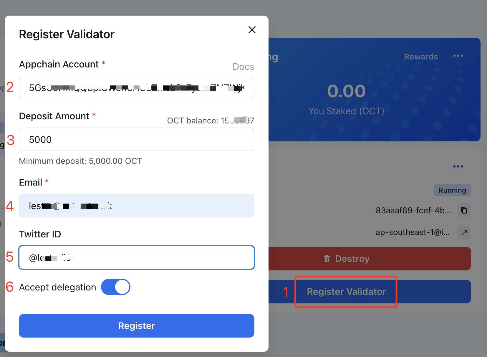

After successful registration, please wait for about 1~2 minutes, and the validator's appchain account will receive one appchain native token which used for the next step.

### Set Session Key

**Note**: Please make sure that the validator node has completed the synchronization of the chain data, and the validator's appchain account has received th appchain native token.

Click `...` on the **My Node** area of ​​the appchain page, select `Set Session Key`, and on the pop-up page, select the appchain account filled in the registration.

For the automatically deployed validator, click `Set`.

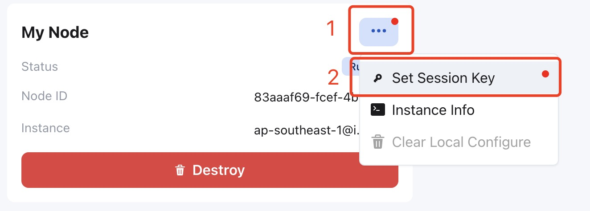

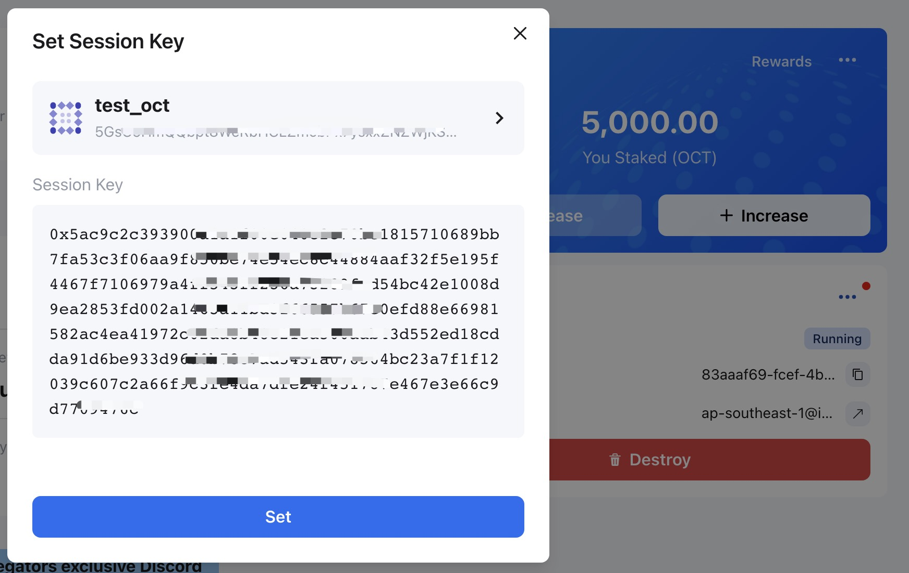

### Set Session Key - manual deployment

For the manually deployed validator, you can set the Session keys by submitting the `setKeys` transaction via the PolkadotJS-APPS RPC. 

Attach the [PolkadotJS-Apps explorer](https://polkadot.js.org/apps/#/explorer) to the appchain gateway node, the validator can configure the `custom endpoint` with the appchain RPC Endpoit in the `Settings` tab.

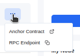

Once ensuring that you have connected to appchain RPC endpoit, navigate to `Developer` tab and select `Extrinsics` then select the appchain account which you filled in the Register validator step, and select the `session > setKeys(keys, proof)`, input the content of the `result` field that you get from the [Generate Session Keys](./validator-set-session-keys) step as `keys`, input `0x0` as `proof`, finally, submit the transaction.

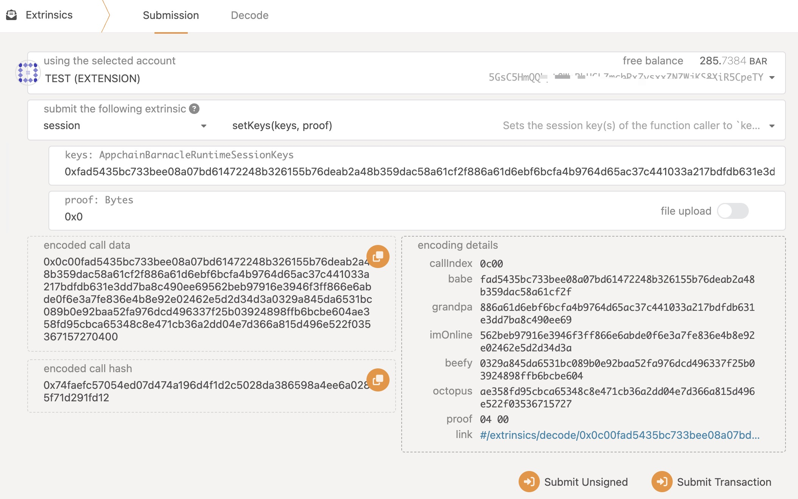

The validator will be added into the next round of validator sets after waiting for a reward cycle (~1 day).

#### Check Session key

Open the [PolkadotJS-Apps](https://polkadot.js.org/apps/),  the validator can configure the `custom endpoint` with the appchain RPC Endpoit.

Once ensuring that you have connected to appchain RPC endpoit, navigate to `Developer` tab and select `Chain State` then select the `session > nextKeys(AccountId32)` option, and select your validator account, and then click `+`. 

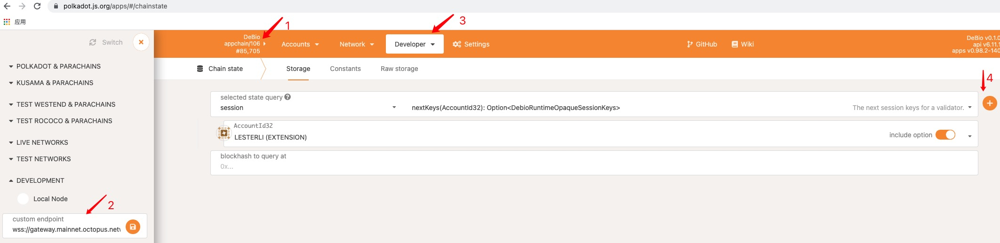

Check whether the return value is consistent with the Session keys you have set.

### Claim rewards

After a reward cycle (~1 day), the validator will receive the staking reward, which needs to be claimed manually. In the **My Rewards** area, click **Claim** , and then click the `Claim All` button to claim the reward.

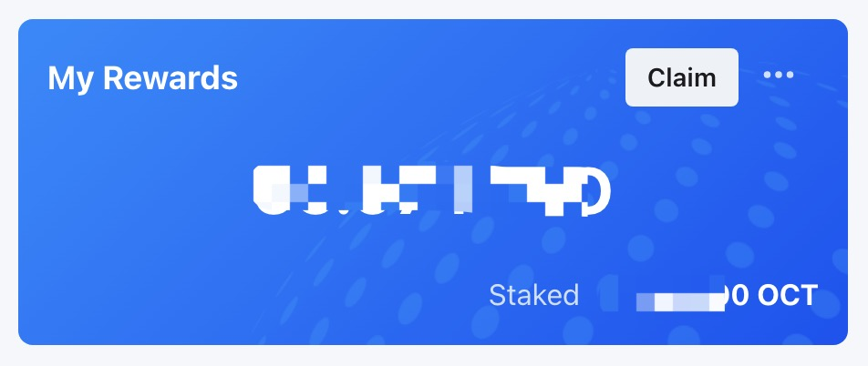

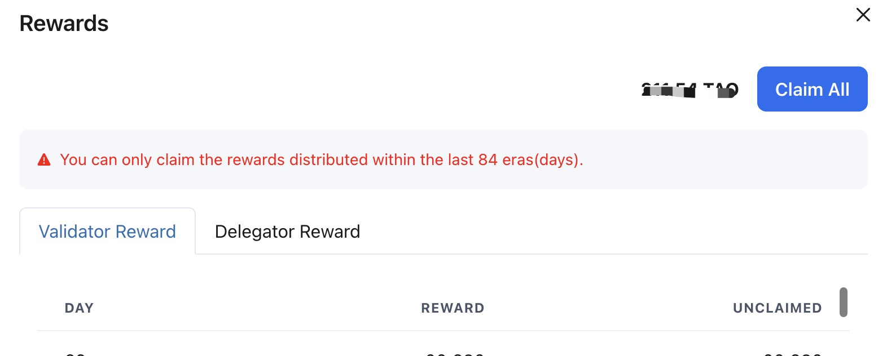

**Warning**: The validator needs to claim the rewards in time, and the rewards that exceed 84 days will not be claimable.

### Stop validating

To stop validating, it needs to unbond staking and stop the validator node.

### Unbond staking

Click `Manage` to open the `Validator Profile` page.

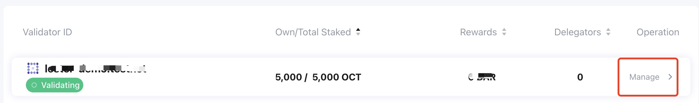

Click the `Unbond Validator` button on the `Validator Profile` page to perform the unstaking operation.

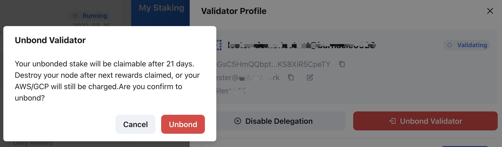

> **Note**: After unbond, the staking OCT will have an unbonding period. Before the unbonding period ends, it cannot be withdrawable and you will not obtain any staking rewards.

### Stop the validator node

For the node which was deployed via the automatic deployment service, the validator can click `...` and select `Destory` in the **My Node** area to stop the validator node and delete the instance of automatic deployment.

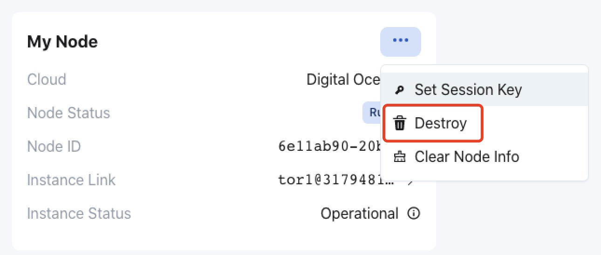

For the node which was deployed manually, please remember to stop it.

> **Note**: After unbond, if stop the node immediately, the validator will have no rewards for the last reward cycle. If stop it after one reward cycle, the validator will still have the rewards.

### Withdraw staking OCT

Click `...` and select `Withdraw Stakes` on the **My Rewards** area.

After the unbonding period ends, you can click the `Withdraw` button to withdraw the staking OCT.

