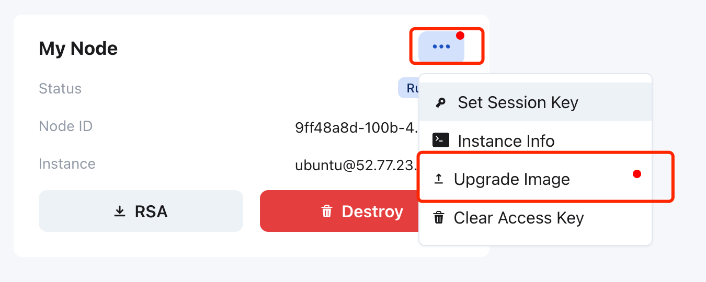
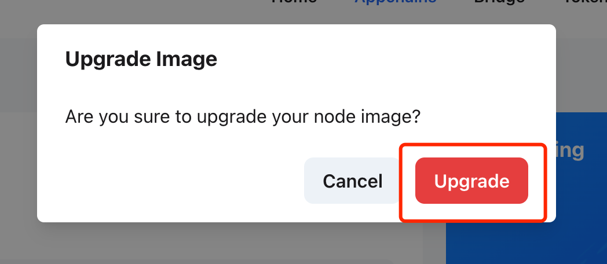
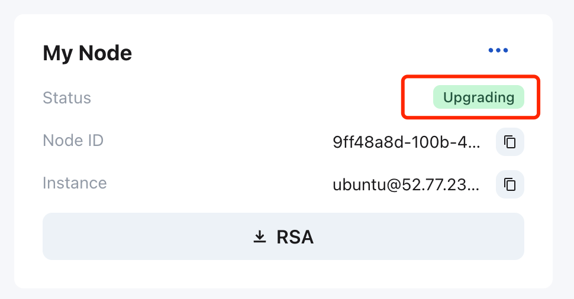

## Upgrade Validator Node

When the Appchain releases a new version of node, validators need to upgrade their validator node.

For validators who deployed the validator node with the auto-deploy service, you only need to go to the Appchain page, the  **My Node**  section, click `Upgrade Image` to complete the upgrade. 

Click `Upgrade` and input your AWS secret key, confirm, the node status will be `Upgrading`.

When the node status changes from `upgrading` to `running`, you can visit [Telemetry](https://telemetry.mainnet.octopus.network/) to check whether the version of the validator node has been properly upgraded.

For validators who manually deploy the validator node, please follow the **validators-delegators** channel on Discord. The Octopus Network team will publish information about the new version of the Appchain node. You need to:

* 1. Compile the new version of Appchain source code to generate a new Appchain client;
* 2. Stop the validator node before the upgrade;
* 3. Launch the validator node with the new Appchain client.

If you deployed using Docker, you can use the Docker image compiled by Octopus Network. For example: [Myriad Node v2.1.5](https://github.com/octopus-appchains/myriad-node/releases/tag/2.1.5)