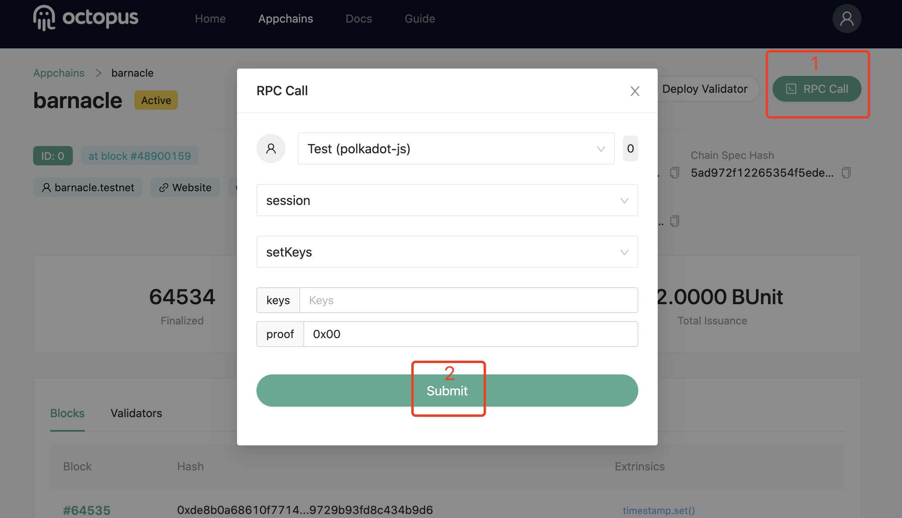

## 设置会话密钥

在设置验证节点的会话密钥前，需要完成以下准备：

首先，需要已安装好 Polkadot{.js} 浏览器插件，并已创建了应用链的账户。

其次，需要远程登录进部署验证节点的服务器，完成`author_rotateKeys`操作，通过执行以下命令：

```bash
curl -H "Content-Type: application/json" -d '{"id":1, "jsonrpc":"2.0", "method": "author_rotateKeys", "params":[]}' http://localhost:9933
```

输出中有个十六进制编码的“result”字段，保存此字段的值以备后用。

此时可以重新启动验证节点。

完成上述准备后，验证人访问章鱼网络[测试网](https://testnet.oct.network/)，在应用链列表中，选择要成为验证人的应用链，点击进入操作页面，只需进行以下2步操作：

1. 在操作页面中，点击`RPC Call`；
2. 在弹出页面中，选择你的应用链账户，RPC 选择`session`，Callables 选择`setKeys`，字段`keys`中输入`author_rotateKeys`操作的输出，字段`proof`中输入`0x00`，然后点击`Submit`。

如下图所示：

